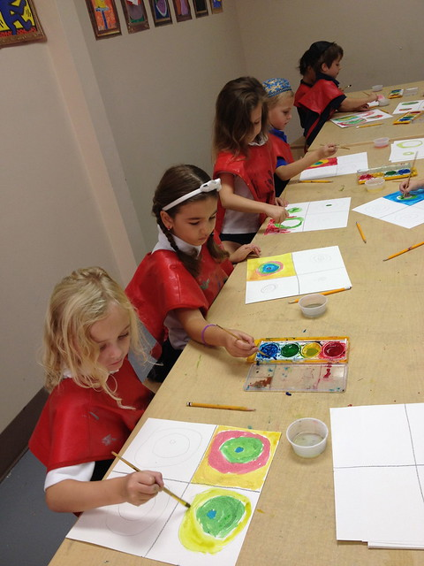
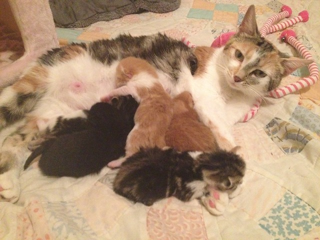
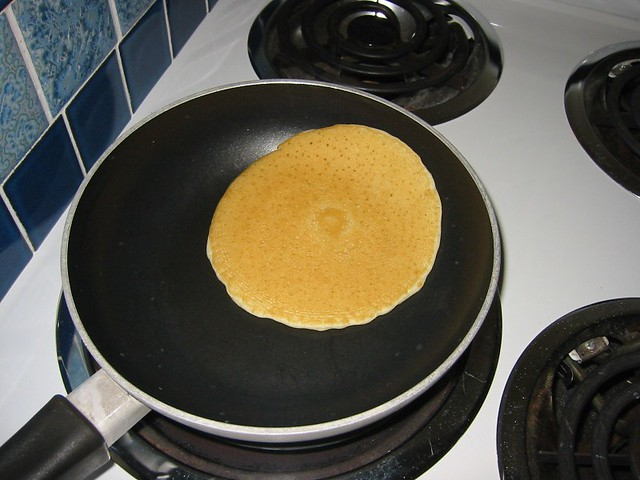
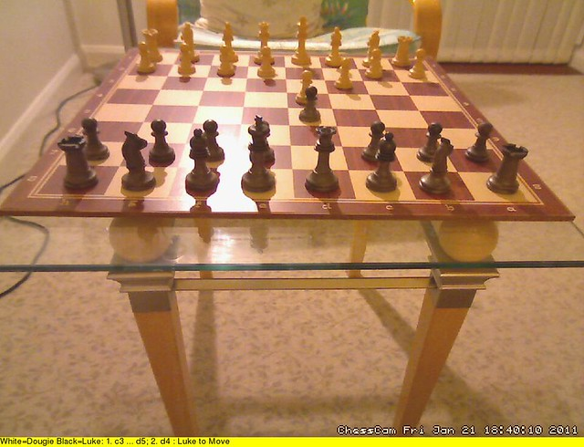

# Enough Python to Fake It 

---

# This presentation 

http://github.com/catherinedevlin/talks/just-enough/python

--- 

# Seating 

Programming is social.

--- 

# Goal 

- None specific! 
- Remove fear & spark joy 
- Comfortable in the community 

## Presenter Notes 

If you put "Python" on your resume, you're lying

--- 

# Yay Python!

- Easy start, no end
- Clean and readable 
- Libraries for everything
- Thriving community
- "Second-best at everything"

--- 

# Everything except 

- Programming web browser 

--- 

# Setup 

[pythonanywhere](https://www.pythonanywhere.com/)

- Signup for free Beginner account
- Select "Consoles"
- Start a new console: Bash

`git clone https://github.com/catherinedevlin/just-enough-python.git`

--- 

# Run some Python 

- Hit Back 
- Files
- Directories -> just-enough-python -> 010-a-print.py
- `>>> Run this file`

---

# [Grand Rapids Chicks](https://www.aagpbl.org/teams/grand-rapids-chicks/1945)

---

# Exercise structure  

A: works 

B: almost finished; finish it!

C: less finished; finish it!

D: Debug me!

E: extra credit

--- 

# Use the stickers 

Put both stickers up 

Remove Blue when you finish B (B - Blue)

Remove Red other when you finish C (C - Crimson)

--- 

# Go! 

There is no "done"

--- 

# Congratulations!

---

# Jargon

---

# Object Orientation

Some pieces of data + 

some code that works on it = 

Object

--- 

# Class and Instances

--- 

# More OO

- Class method 
- Instance method 
- Subclass 

--- 

# Data types

- Boolean: `True`, `False` 
- tuple: ('Like', 'a', 'list')
- 'Ünicødè'

--- 

# Iterators 

- iterate 
- iterable 
- generator
 
## Presenter Notes 

Loopable, because it remembers

--- 

# Techniques 

- hash 
- cache
- queue

## Presenter Notes
 
your desk vs. your bookshelf

orders on the wheel at a diner 

--- 

# Lazy evaluation

--- 

# DSL 

Domain Specific Language 

- Starbucks-ese
- regex: `*.*` ++ 
- SQL 
- HTML

Generally "declarative"

## Presenter Notes

Describes the state you want to get to 

---

# Python tricks 

- introspection 
- decorator: `@`
- annotations 

## Presenter Notes

psychologist couch 

aftermarket cup holder

--- 

# REPL 

Read Evaluate Print Loop

## Presenter Notes

improv comedy 

--- 

# IDE 

Integrated Development Environment

- mu
- VSCode 

--- 

# Version Control 

Breadcrumbs + cooperation 

- Git, GitHub 
- Repo
- Commit 
- Branch, Fork 
- Pull Request 

---

# Libraries = tools 

packages, modules

install = buy 
import = put on counter 

--- 

# Installation  

pip 
PyPI

---

# virtualenv 

---

# Docker 

Kitchen delivery service 

---

# Testing 

Code that tests code 

- Regression testing
- Test suite 
- Mock
- TDD 

--- 

# Test types

Unit test

  "Tire pressure between 35 and 40 PSI"

Integration test 

  "Drove around the block"

--- 

# Web 

- Server-side
- Client-side (browser)

Television station vs. television set 

--- 

# Web libraries 

- Django 
- Flask 

--- 

# Ops

- Getting stuff on the server 
- Keeping it alive there

"DevOps"

Taping a show vs. running the station

---

# Architecture

- microservice 
- cloud 
- serverless

--- 

# concurrency 

- process, thread 
- async 
- callback 

## Presenter Notes

scavenger hunt 

--- 

# Continuous Integration 

- Run test suite 
- Build documentation 
- Run linter 
- Check code quality 
- Deploy

--- 

# Database

- Query
- Relational
  - RDBMS
  - SQL 
  - ORM
- Nonrelational
  - NoSQL 

--- 

# More data terms 

- schema
- flat file
- persist 

--- 

# serialize

- JSON 
- XML
- YAML

--- 

# Theory terms

- abstraction 
- side effect
- Pythonic

---

# How to learn 

---

# Beginner resources

- python.org > Beginners' Guide 
- [pythontutor.com](http://pythontutor.com/)
- [Automate the Boring Stuff](https://automatetheboringstuff.com/)
- [Circuit Python Express](https://learn.adafruit.com/adafruit-circuit-playground-express/circuitpython-quickstart)
- [Python Koans](https://github.com/gregmalcolm/python_koans)

--- 

# All-level resources 
 
- [pdb](https://pyvideo.org/pyohio-2014/so-you-think-you-can-pdb.html) or debugger
- [PyVideo](https://pyvideo.org/)

---

# Find libraries! 

"Has anyone ever..."

Yes.

---

# Intermediate resources 

- [Module of the Week](https://pymotw.com/3/)
- [Hitchhiker's Guide](https://docs.python-guide.org/)
- [Python Cookbook](http://shop.oreilly.com/product/0636920027072.do)

--- 

# Community 

- Local, regional 
- Ask questions!
- Take a vocab card!

--- 

# [Jupyter](https://jupyter.org/)

Experimenting and documenting tool

--- 

# Setup open-space 

- Install Python 
  - Python 
  - Jupyter 
  - Mu 

... and try them out 

---

# Go Team!

You did it!

--- 

# Images 

"Kindergarten" by MJGDSLibrary is licensed under CC BY-NC-ND 2.0 

"Nickle (tabby-co cat) and the metal kittens" by Helena Jacoba is licensed under CC BY 2.0 

"Pancake!" by noricum is licensed under CC BY-SA 2.0 

"Wren 2018 CG Kitchen Projects" by Pikcells Ltd is licensed under CC BY-NC-ND 4.0 

"Chess" by dougienisbet is licensed under CC BY-NC 2.0 
