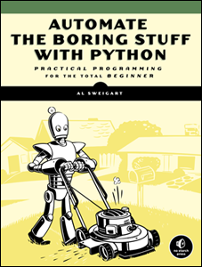

:css: css/smalldata.css
:data-transition-duration: 200

.. title:: small data

----

small data
----------

Catherine Devlin

PyCon 2018

GH: catherinedevlin/talks

----

WELCOME TO OHIO
===============

.. image:: img/ohio.svg
   :height: 500px
   :alt: Ohio flag

----

.. image:: img/pyohio2018.jpg
   :height: 500px
   :alt: PyOhio

.. note::

    Last weekend in July.

    CFP closes on Tuesday, the 15th

----

.. image:: img/dayton-to-cleveland.png
   :height: 500px
   :alt: Route from Dayton to Cleveland

----

.. image:: img/new_oil.png
   :height: 500px
   :alt: Data Is The New Oil

----

- Authoritarianism
- Pollution 
- Climate change
- War 
- Ghost ex-boomtowns

.. note::

    Commercial world is paying attention.

    We consider that a sign of importance.

----

Professionalization
-------------------

Data Science

Technique, tools, standards...

(Salaries!)

.. note::

    Professionalization of data handling fosters 
    commercial success, which in turn funds more 
    professionalization.

    And there's a lot that's very good about that.

    But hold on: who uses big data?  Big institutions
    use big data.  Do they use it to everyone's 
    benefit?

    Sometimes yes, sometimes no, but all of the 
    time, most people feel distanced from and 
    mystified by what's being done with data.

    So when we celebrate our power to change the world...

----

Data janissaries?
-----------------

.. image:: img/janissaries.jpg
   :height: 500px
   :alt: Janissaries

.. note::

    But change the world to what?  
    
    Are we going to serve the public in general, or a controlling elite?

    Are we going to just help a dominant class dominate?

    Make a stratified world more stratified?

----

.. image:: img/hospital_food.jpg
   :height: 500px
   :alt: Hospital food

.. note::

    If you're sick and a friend cooks you dinner, it's the
    sweetest thing in the world.

----

- Powerful
- Mysterious
- Out of your control

.. note::

    Most people understand that data has a huge role in the 
    modern world, predicting it, guiding it, guiding them.

    But they feel they have no control or even understanding 
    of what's being done.  It's all behind-the-curtain wizardy.

    That's a very alienating feeling.  It makes people feel 
    like their society is not their own.

----

.. image:: img/18f.svg
   :height: 400px
   :alt: 18F logo

.. note::

    I work for one of the biggest institutions of all, the 
    U. S. Government.

    18F is a U. S. Federal agency that helps other Federal agencies build
    and buy software better, using the technology and the techniques
    that everybody in this room loves.

    In particular, it is chock-full of Python.

    You should consider doing a tour among the amazing Pythonistas
    of 18F.  It's been the best experience of my professional life.

    My apologies to non-Americans for the US-centric portions of this
    talk, but it's very likely that you have similar dynamics going on
    in your own country, and you may have 18F-like agencies as well.

----

.. image:: img/not-18f2.png
   :height: 400px
   :alt: 18F logo with Forbidden bar

.. note::

    Not an 18F talk

    My personal views, not those of U. S. Government.

    I am on vacation, on my own dime.

    If my supervisor calls, you haven't seen me.

----

USASpending.gov
---------------

.. image:: img/usaspending-frontend.png
   :height: 500px
   :alt: USASpending.gov screenshot

.. note:: 

    I've gotten to
    work on some really great projects, mostly about helping 
    the public get at their data: Federal Election Commission,
    the FBI's Crime Data Explorer.
 
----

USASpending.gov API
-------------------

.. image:: img/usaspending-api.png
   :height: 500px
   :alt: USASpending.gov API screenshot

.. note:: 

    We and many others are working to make more 
    public data fully and truly open, the way it 
    ought to be.  But data can't just be pushed, 
    it needs to be pulled, too.  People need 
    the skills and the attitude of engagement 
    to complete the circuit, to use that data. 

----

Do not trust your government.

----

Manage your government.

.. note::

    We are your employees.

    We need your feedback and your involvement and 
    your engagement and your management. 

    And your society in general.  Don't despair.  
    Don't disengage.  Don't get cynical. 

----

.. code:: python

    cynicism == (learned_helplessness
                 + resentment)

    empowerment == engagement

.. note::

    People think of cynicism as a defense against manipulation,
    but it isn't.  Cautious skepticism is a defense; cynicism, 
    defaulting to mistrust, is a defense mechanism, and makes 
    us easier to manipulate.

    Cynicism breeds disengagement, despair, and passivity,
    which divides us, neutralizes us, conquers us.  
    
    There are lots of causes of cynicism, including groups 
    intentionally fostering it to make us easier to manipulate, 
    but I'm convinced that one big cause is this disconnection 
    from the world of data that helps so much to steer the 
    world.

----

Chickens
--------

.. image:: img/chickens.jpg
   :height: 500px
   :alt: chickens

.. note::

    This is where my eggs come from.

    Oddly enough, nowhere on earth have I faced as much peer
    pressure to keep my own chikens as at PyCon.

----

Mile Creek Farm CSA
-------------------

.. image:: img/milecreek3.jpg
   :height: 500px
   :alt: harvesting vegetables

.. note::

    Most of our food supply is heavily commercialized, industrialized.

    There's a huge movement of small farmers, organic farmers,
    gardeners, farmers' markets, community-supported agriculture,
    all creating small-scale, local alternate channels to that
    mainstream food industry.

    It's probably not going to replace the conventional food 
    industry, but every little bit of close and personal contact
    with the food supply you can give people increases their 
    engagement, familiarity, knowledge, mindfulness.

    Democratizing the food supply, even a little, is worth 
    doing.

----

Community-supported dataculture
-------------------------------

.. image:: img/datacreek3.jpg
   :height: 500px
   :alt: harvesting data

.. note::

    So imagine home data gardens full of fresh, ripe, 
    organic, sustainably and humanely raised 
    lists and dictionaries and integers and decimals.

    Imagine a small data movement democratizing 
    the use of data a little bit like the local 
    food movement.

    If people - lots of people - gain personal 
    experience in gathering and processing data, 
    even in small and simple ways,
    can that make them more knowledgable and 
    engaged in a society that's increasingly 
    data-driven? 

    Let's do experiment.

----

Skills
------

- Gathering
- Processing
- Combining
- Presenting

.. note::

    By beginner data programming, I'm talking about some 
    very basic skills.  I'm not talking about running 
    Scikit-learn against your hadoop cluster.  I'm not 
    even talking about querying PostgreSQL.  
   
    I'm talking about pulling some data into maybe a list 
    of dictionaries, applying some basic Python to it 
    from there.  Stuff that people can plausibly start on 
    within a few hours of `print "Hello, World!"`

----

Empower whom?

  - students (Jessica McKellar 2014 keynote)
  - journalists
  - small businesses
  - activists and organizers

.. note::

    I mean, aside from everyone, of course.

----

Local Governments

.. image:: img/city_employees.png
   :height: 500px
   :alt: Tweet regarding teaching to city employees

----

Not a teacher?
--------------

Nobody wants your excuses.

.. note::

    If you're on the verge of tuning out because you think this is
    an educator, you are not excused.  Everybody is part of the
    effort, as you'll see as I go on.

----

Projects
--------

.. note::

    What's within reach for a data amateur that's worth doing?

    Let's make this easier to think about with a very non-exhaustive list of
    possibilities to get your imaginations running ambitiously

----

`csv`
-----

.. note::

    This should be one of the main teaching libraries.

    Almost everybody's life is touched by spreadsheets.
    Some people's lives are saturated in spreadsheets.
    And, when you save a spreadsheet as a CSV, the 
    transition to programmable data is very clear, zero 
    mystery.

    There are more specialized libraries for handling spreadsheets,
    but this is a minimal-mystery approach straight out of the
    Standard Library.

----

email
-----

.. note::

    Most people feel overwhelmed by email.  It was the first form of
    information overload.

    The filters etc. provided by email providers are nowhere near as
    sophisticated and specific as even a beginner's data-handling 
    program could be.

    This is a huge source of personally relevant (maybe) data for most
    people.  Or, that is, 1% personally relevant and 99% completely 
    irrelevant, and helping them do that sort will give them power.

----

social media
------------

.. note::

    When big data makes the news, they're often talking about 
    social media, and it's a big part of most people's lives,
    so the fact that they can analyze their own social media 
    world in any way they can imagine should be inspiring.
    
    Which of my friends share an interest?  Which of them share 
    an interest but don't yet know each other?  
    Who's announced weekeng plans?  Who's going to PyOhio?
    Who's actually a bot?

    Are there hours of the day when I'm more likely to make misspellings
    or threaten foreign countries?

----

twitter-scraper_
----------------

.. _twitter-scraper: https://github.com/kennethreitz/twitter-scraper

.. note::

    Speaking of social media, twitter's API is needlessly 
    complex and a barrier to newbies.  

    But there's a new Kenneth Reitz package - and if you know 
    Kenneth Reitz, I can stop talking right there - avoids all 
    needless complexities.

---- 

#pyconopenspaces collector
--------------------------

.. note::

    In fact, I intend to use it during the sprints to 
    write a little hashtag miner to generate a table 
    from the #pyconopenspaces hashtag.

    If you want a short break from your main sprint, 
    we can work on it together.  It'll be useful for 
    next year, and it'll be good practice for what 
    we want to show people.

----

Webscraping
-----------

- requests_     
- BeautifulSoup_
- requests-html_

.. _requests: https://github.com/requests/requests
.. _BeautifulSoup: https://www.crummy.com/software/BeautifulSoup/
.. _requests-html: https://github.com/kennethreitz/requests-html

.. note::

    Webscraping is getting data from websites that weren't
    designed to provide data to your programs, but only to
    be used by human eyeballs.  So it's a little tricky,
    but there are huge quantities of data locked up in it,
    and we have some good libraries to help us unlock it.

    These three in particular are nice beginner-friendly
    tools.  `requests-html` is pretty new - it's another 
    fine Kenneth Reitz product.

----

.. role:: strike
    :class: strike

:strike:`World Wide` Web
------------------------

- Local directories
- Local event calendars

.. note::

    One of the nice things you can do with scraping is assemble
    and then republish locally relevant information.

    Local Resources, businesses, organizations, governmental bodies -
    they tend to publish independently on scattered, obscure websites.
    Can you unbury it?

    And speaking of information rescue...

----

Self-generated data
-------------------

- Files
- Photos

.. note::

    Most people with a personal computer have lost track of what is on it.
    They feel intimidated even by data of their own generation.  Data 
    handling skills could help them organize and de-duplicate it.

----

APIs
----

- Governments
- Social media
- Vendors

.. note::

    It's easy to consume and use data when it's provided 
    by web APIs.  That's why they exist, after all.

    Maybe the hardest thing about them is knowing that 
    they exist.  It's kind of a pity that we hide this 
    beginner-friendly data resource behind a cryptic and 
    intimidating acronym.

    So let people know!  And help them find APIs that 
    interest them.

----

Open data hubs
--------------

    - data.gov
    - `Humanitarian Data Exchange`_
    - `curated API lists`_
    - `Open Data Census`_

.. _Open Data Census: http://us-cities.survey.okfn.org/
.. _Humanitarian Data Exchange: https://data.humdata.org/
.. _curated API lists: https://github.com/abhishekbanthia/Public-APIs
.. _Open Data Census: http://us-cities.survey.okfn.org/

  Beware firehose

.. note::

    There are so many directories of APIs that we really 
    need a directory of directories.  As a Fed, I need to 
    point out data.gov, for instance.  

    Actually, some of the nicest directory take the form 
    of simple hand-curated lists in GitHub repositories, 
    so websearch around on some of those.

----

`Open Data Census`_
-------------------

.. _OpenData Census: http://us-cities.survey.okfn.org/

.. image:: img/open_data_census.png
   :height: 500px
   :alt: Open Data Census screenshot

.. note::

    The Open Data Census is a volunteer-curated grid of 
    open data resources for various types of city data 
    for a wide array of cities.  
    
    It's useful as a source 
    of data, obviously, and volunteering to help populate 
    the Census is itself a great exercise in building 
    data-hunting skills and helping citizens get to know 
    their cities' digital presence.

----

Presenting the info
-------------------

.. note:: 

    With minimal effort.  Not full-fledged web dev 

----

Static sites
------------

Jekyll, Pelican, GH Pages... 

`The New Dynamic`_ 

.. _`The New Dynamic`: https://www.thenewdynamic.org/

----

Visualizing 
-----------

- prettyprinting

- matplotlib, Bokeh... 
  
- altair-viz

- Leaflet (Folium) maps

----

Re-presenting data
------------------

Dayton LotLinker_

.. _LotLinker: http://www.lotlinker.com/

.. image:: img/lotlinker.png
   :height: 500px
   :alt: LotLinker screenshot

.. note::

    Dayton has abandoned, forfeited houses that you can buy from the city
    for about $2500, but the information about those houses was only available
    through a spreadsheet that was not a very good interface for finding places
    to consider.

    So Code for Dayton, our local Code for America brigade, processed that
    spreadsheet into a Leaflet map and published is as lotlinker.com.

    As you can see, we have room for all of you, so if you want to carpool to
    PyCon 2019 from your new house in Dayton, let me know.

----

`More ideas`_
-------------

.. _More ideas: http://opendatahandbook.org/value-stories/

.. image:: img/value_stories.png
   :height: 500px

.. note::

    Open Knowledge International has a set of value stories
    that can jog your imagination.  Most of them are for large-
    scale data use, but they can still touch off related ideas
    in you - or, more importantly, in the people you're going
    to empower.

----

Code for America
----------------

2015: Catherine Bracy

.. image:: img/c4a.png
   :height: 500px
   :alt: Catherine Bracy at PyOhio 2015

----

"How can I, a humble Pythonista with a bag full of PyCon swag,
help bring about this revolution?"

----

Teach
-----

.. note:: 

    Not necessarily as a teacher as such, though that's 
    especially awesome!

    Workshops at library

    One-time guest presenters - I did an hour at a 
    Dayton high school on using a RESTful API

    Groups like Girl Develop It 

----

`Data Carpentry`_
-----------------

.. _Data Carpentry: http://www.datacarpentry.org/

.. image:: img/DC_logo_vision.png

.. note::
    Data Carpentry is, in a sense, already on this problem,
    though they're aimed more at institutions full of people
    who are already convinced that they need to build their
    data skills.

    It's a great organization with a great curriculum, and a
    great program to train Data Carpentry instructors - worth
    checking out.

---- 

Write 
-----

----

---- 

- blog
- articles

.. note::

    Yes You Can!

    Small local publications, business publications...

----

`Julia Evans`_
--------------

.. _Julia Evans: https://drawings.jvns.ca/

.. image:: img/pipes.svg
   :height: 500px

.. note::

    I want to point you to Julia Evans' great Unix cartoons
    as an example of how effective writing or drawing can 
    be when it's very informal and very fun.  So don't get 
    writers' block thinking you're writing a doctoral 
    dissertation.

----

Speak 
-----

(not here)

.. note::

    Go speak to people who aren't programmers yet.  Go to the 
    business groups, the activist groups, the professional 
    organizations, and give them a taste.  

    Most groups love new speakers.

----

Signal-boost
------------

.. note::

    With most software problems, finding the right package to do it
    with is half the battle.  The other half is finding good tutorials
    or examples.  So, if you find them and help make them more
    prominent, you are a teacher.

----

Make it easier
--------------

.. note::

    So far, I've been talking about how to raise people's skills

    But it's even more important to demand less of them

----

Open that data
--------------

.. note::

    Wherever you work, wherever you volunteer, wherever 
    you live, wherever you vote - have they opened up 
    their data?  You have influence there and can be a 
    voice for openness.

    You have knowledge and can make the case for 
    openness clearly.  Please do!

----

Easier code
-----------

- Improve the API
- Wrap existing packages
- Connect existing code

.. note::

    Many packages are built with APIs that conform to the
    gigantic brains of the experts who created them, 
    and who are not bothered by their complexity.

    But an API can instead conform
    to the expectations of a person who doesn't yet understand the
    domain.

    Find or be a newbie, keep track of their uninformed guesses, 
    their wishes, and make those wishes come true! 
    
----

Write the docs!
---------------

- Join projects
- File documentation PRs
- Create examples
- Answer questions

.. note::

    .. which is, of course, the name of a conference

----

Ignorance is precious

.. note::

    .. Never waste precious ignorance 

----

OKI's `data packages`_

.. _data packages: https://frictionlessdata.io/data-packages/

.. image:: img/data_packages.png
   :height: 500px
   :alt: Data Packages screenshot

.. note::

    Ease of use applies to data, not just software.

    Data availability is not really boolean.  Lots of data is
    technically open or available, but actually difficult to
    find it and use it.

    data-packages is a container format to wrap data and metadata
    together in a way that makes it easier to discover and lets
    people write tools to automate the process of getting 
    into your Python program to work with.

    So far, only a small fraction of data is published that way,
    and only a few people know how to use those tools, so this
    leads lots of signal-boosting!

----

Honeywell 316 `Kitchen Minicomputer`_
-------------------------------------

.. _Kitchen Minicomputer: http://www.computerhistory.org/revolution/minicomputers/11/362

.. image:: img/kitchen_computer.png
   :height: 500px
   :alt: Kitchen Minicomputer

.. note::

    Neiman-Marcus catalog, 1969

    A gee-whiz technical solution that is completely wrong for the problem?

    To a certain degree, yes.  None of this absolves society or us personally
    from the non-technical aspects of saving the world.

    Still, we are nerds, glory be, and our nerdship is changing the
    world, so I think we're responsible to make sure at least some
    of those changes are positive.

----

Ambitions
---------

.. note::

    So let's think of some of the pathways by which we hope to 
    connect immediate goals to ultimate goals.  How is a small 
    data movement supposed to foster a more engaged society? 

----

Civic engagement
----------------

- Sense of ownership
- Habits of participation

.. note::

    When you go to your city for data, that's engagement.

    When you nag them for data they haven't released yet, that's
    deeper engagement.

    When you point others toward the civic information 
    you've re-published or analyzed or visualized 

    When you urge action based on what's been found 

----

Data ethics
-----------

Diversity 
---------

.. note::

    Ethics in data science is a topic to itself, but the more
    people have experience even with small-scale data handling,
    the more people will understand its importance.

    All data handling helps you appreciate the complexity 
    of data, the approximations always included, 

    The more variety of people can contribute informed feedback 
    to data-handling efforts, the more viewpoints go into the 
    ethical decisions. 

----

Smarter data consumers
----------------------

.. note::

    People with a deeper awareness of how data is gathered
    and used.

----

Create open data demand
-----------------------

.. image:: img/ingredients.jpg
   :alt: ingredients list from food label

.. note::

    I mentioned it earlier:
    Open data producers need opend data users.  They justify 
    the effort of opening up data sources.  

    And, by the way, when you use an open data source, it's 
    very heartening let the publishers know.  At 18F, anytime
    we hear of data we've helped open up being put to use, 
    we're thrilled.

    As using data becomes the norm, it becomes less acceptable
    not to open up data.  Imagine a can of food with no ingredient
    label.  Would you buy it?  Probably
    not, because ingredient labels have taught us to feel entitled
    to that data, even if we don't plan to use it.
    
    I want to grow that kind of sense of entitlement.

----

Strengthen local institutions
-----------------------------

.. note::

    Near-exclusive acccess to data-handling skill has been
    one advantage of big and global institutions over small
    and local ones.  So breaking that monopoly can help 
    rebalance those scales. 

    Not just businesses: can your community library, theater
    troupe, bowling league, garage bands compete for attention?

----

Contents:
---------

One (1) hearwarming closing story 

----

.. image:: img/Kimber.jpg
   :height: 500px
   :alt: Kimber the dog

.. note::

    Josh Cory has been learning Python at the Dayton Dynamic
    Languages user group.  Kimber belongs to his friend Jeff.

----

Duck, turkey, pork, banana, peanut, fish, salmon, peas, oats, tomato and berries.

.. note::

   If you've seen dog food ingredient lists - they're long,
   fine-print monstrosities.  And there are dozens of dog
   food companies with multiple brands each.

   That's a lot of hairy anti-joins 

----

.. code:: python

    ['duck', 'turkey', 'pork',
     'banana', 'peanut', 'fish',
     'salmon', 'peas', 'oats',
     'tomato', 'berries']

.. note::

    But as a data problem, this is not bad.

----

1. Find API
2. Download brand/flavors
3. Extract and normalize ingredient lists
4. compare to `ALLERGIES`
5. generate list of safe foods

----

.. image:: img/Kimber.jpg
   :height: 500px
   :alt: Kimber the dog

.. note::

    Kimber is a good dog.

----

Data to the people!
-------------------

@catherinedevlin

catherine.devlin@gmail.com

GH: /catherinedevlin/talks

.. note::

    Go forth, bring the data to the people 
    and the people to the data, and let's do 
    our part in saving the world.

    I'm consistently branded, easy to find,
    you know where I live, and I'm staying for
    sprints.

----

Pew Research results:

- http://www.pewresearch.org/fact-tank/2018/03/27/americans-complicated-feelings-about-social-media-in-an-era-of-privacy-concerns/

- http://www.pewinternet.org/2014/11/12/few-feel-that-the-government-or-advertisers-can-be-trusted/

Photos:

- “Sultan Mehmet III (reigned 1595-1603) Enthroned, Attended by Two Janissaries LACMA M.85.237.34” by Ashley Van Haeften is licensed under CC BY 2.0

- “Hospital food at the PA part one: &quot;Beef Burgundy&quot;” by David Jackmanson is licensed under CC BY 2.0

- Air Force IMSC http://www.afimsc.af.mil/News/Art/igphoto/2001839179/

- Mile Creek Farm https://milecreekfarm.com/photo-gallery/#jp-carousel-1733

- Midwest Propulsion Group
