:css: css/smalldata.css
:data-transition-duration: 200

.. title:: small data

----

small data
----------

Catherine Devlin

PyCon 2018

github.com/catherinedevlin/talks

----

WELCOME TO OHIO
===============

.. image:: img/ohio.svg
   :height: 600px
   :alt: Ohio flag

.. note::

    I love our flag.

----

.. note::

    Last weekend in July.

    CFP closes on Tuesday, the 15th

----

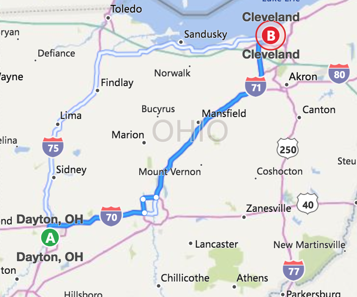

----

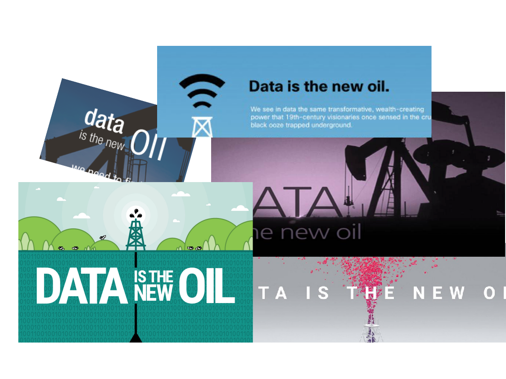

----

- Fosters authoritarianism
- Degrades environment
- Trail of abandoned boomtowns

.. note::

    Commercial world is paying attention.

    We consider that a sign of importance.

----

Professionalization
-------------------

Data Science

Technique, tools, standards...

(Salaries!)

.. note::

    The more data science becomes reality rather than a marketing term...
    the more we can change the world - and get paid to do so, which is
    nice.

----

Data janissaries?
-----------------

.. note::

    But change the world to what?  Are we serving the world in general?
    Or are we going to be enforcers of the dominance of a new ruling caste?

----

- Powerful
- Mysterious
- Out of your control

.. note::

    Because most people agree that data is important and powerful, but they
    also feel very cut off from it.

    If there's a new, controlling power in the world, and you feel that power
    is beyond your ability to control or influence or even understand,
    that's a very alienating feeling.  That's a feeling that it's not your
    world anymore.

----

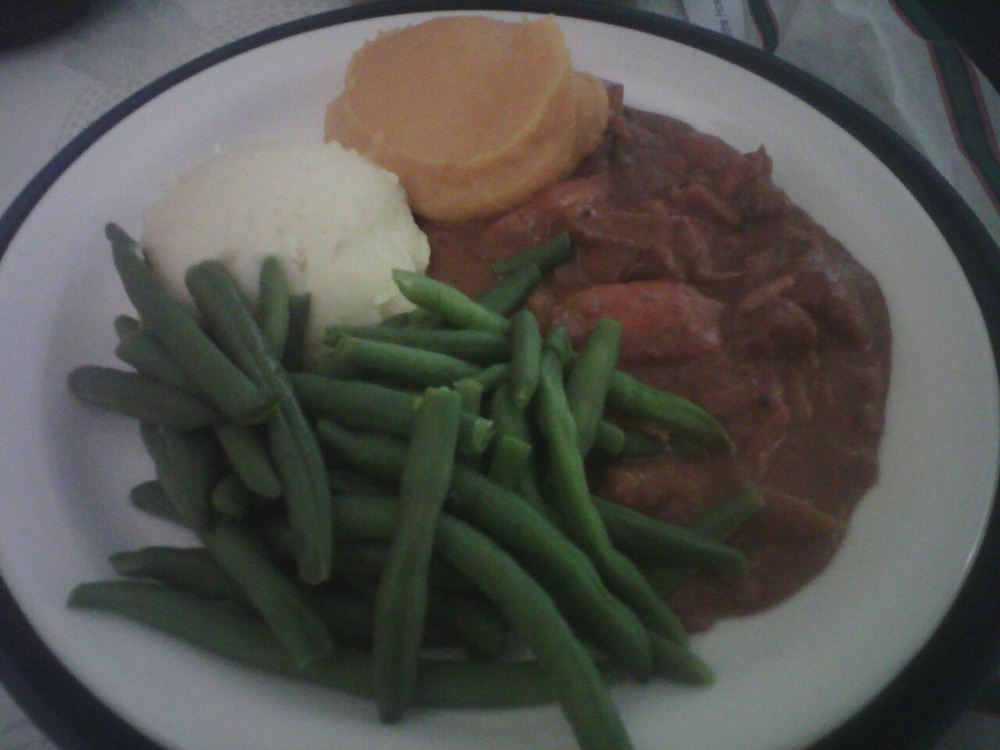

.. note::

    If you're sick and a friend cooks you dinner, it's the
    sweetest thing in the world.

    The sense of a loss of understanding and connection
    breeds alienation.  It's happened to hospital food,
    it's happened to the handling of data, and I'm afraid
    that, partially due to the centrality of data,
    it's happening to our institutions in general.

----

Pew Research:

    Americans’ lack of confidence in communications security is accompanied by low levels of trust in government and advertisers

    The backdrop for this lack of confidence in communications security is low levels of trust in key sectors that Americans associate with data collection and monitoring.

.. note::

    Feeling a little attacked here.  Feeling a little hurt.  Feeling a little hurt at being lumped together with advertisers, actually...

----

Specifically,

    91% of Americans “agree” or “strongly agree” that people have lost control over how personal information is collected and used by all kinds of entities.

    18% of adults believe that the government in Washington can be trusted to do what is right either all (2%) or most (16%) of the time

Government can “never” be trusted: 21% no college, 9% at least some college

.. note::

    18% is really low.  You could get 18% positive responsed to
    "Would you like a pot of boiling vinegar thrown in your face?"

    That's the level of mistrust you might expect in Vichy France.

    But we're not under a foreign power.  This is our own government.

----

.. note::

    18F is a U. S. Federal agency that helps other Federal agencies build
    and buy software better, using the technology and the techniques
    that everybody in this room loves.

    In particular, it is chock-full of Python.

    You should consider doing a tour among the amazing Pythonistas
    of 18F.  It's been the best experience of my professional life.

    My apologies to non-Americans for the US-centric portions of this
    talk, but it's very likely that you have similar dynamics going on
    in your own country, and you may have 18F-like agencies as well.

----

.. note::

    Not an 18F talk

    My personal views, not those of U. S. Government.

    I am on vacation, on my own dime.

    If my supervisor calls, you haven't seen me.

----

USASpending.gov
---------------

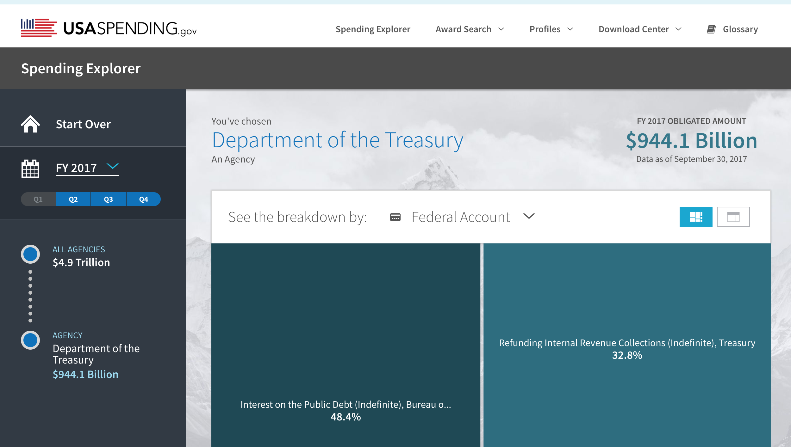

----

USASpending.gov API
-------------------

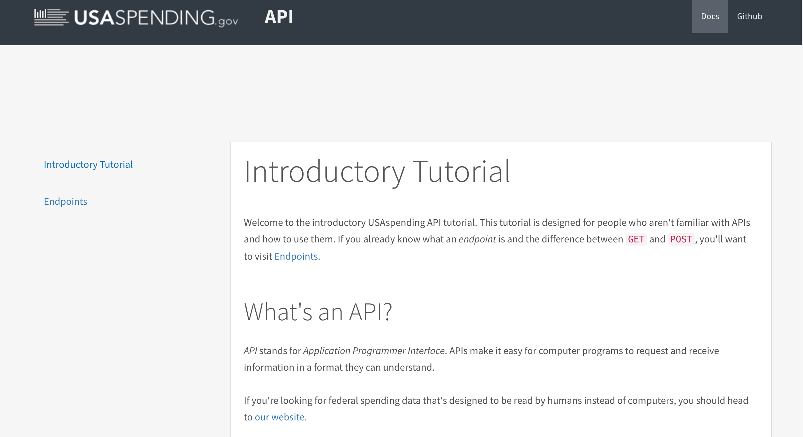

----

"I bet they don't want to let that out!"

.. note::

    18F is an incredibly idealistic place, but being there has
    shown me how low expectations around the government has become.

    Which is sad, because it's our government!

----

Do not trust your government.

----

Manage your government.

.. note::

    We are your employees.

    And I'm really not talking about government specifically, that's just
    that statistics I was able to find.  I'm talking about all forms of
    society-wide cooperative activity, this whole "being an effective social
    species" thing.

----

.. code:: python

    cynicism == (learned_helplessness
                 + resentment)

    empowerment == engagement

.. note::

    People think of cynicism as a defense against manipulation,
    and it is a defense mechanism,
    but it's one that backfires: it lets us be manipulated.

    Cautious skepticism is a defense, cynicism is a defense mechanism.

    The disengagement,
    despair, and passivity that cynicism breeds divides us and conquers
    us.  And there are groups specifically breeding cynicism for exactly
    that reason.

    https://arstechnica.com/tech-policy/2018/04/trump-praises-sinclair-for-spreading-fake-news-warning-on-tv-stations/

    0:50

----

Chickens
--------

.. image:: img/chickens.jpg
   :height: 600px
   :alt: chickens

.. note::

    This is where my eggs come from.

    Oddly enough, nowhere on earth have I faced as much peer
    pressure to keep my own chikens as at PyCon.

----

Mile Creek Farm CSA
-------------------

.. image:: img/milecreek3.jpg
   :height: 600px
   :alt: harvesting vegetables

.. note::

    Most of our food supply is heavily commercialized, industrialized.

    There's a huge movement of small farmers, organic farmers,
    gardeners, farmers' markets, community-supported agriculture,
    all creating small-scale, local alternate channels to that
    mainstream food industry.

    The starry-eyed ones may imagine replacing the conventional
    food industry, but most believe than even a small-scale alternative
    can improve the world - engagement, familiarity, mindfulness.

    They are democratizing the food supply.

    They're not democratizing it completely.  Most people still don't
    garden.  Most food still comes through the industrial food pipeline.
    But every little bit of extra contact that people have with food
    production makes a difference.  2% is better than 1%.  5% is better
    than 2%.

----

Community-supported dataculture
-------------------------------

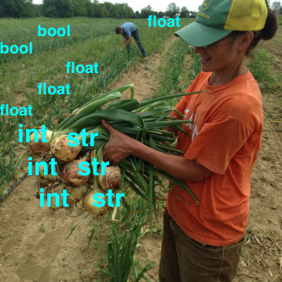

.. note::

    So imagine rows of data sprouting in the sun behind
    ordinary people's homes.

    Imagine little community orchards bursting
    with fresh, ripe JSON.

    Imagine community data markets with baskets brimming over
    with organic, sustainably, humanely grown integers,
    strings, floats, and decimals.

    Remember how those statistics about mistrust got a little bit
    better with education?  My hope is that education and activity
    that specifically brings people contact with the data supply
    can do for data what it does for food.

----

Why Python?
-----------

.. note::

    Many of us were drawn to Python specifically because it's
    so amateur-friendly.

    Many of the biggest tools in the professional data science
    community was made by physical scientists, not computer
    scientists.

    So, of all people, we in the Python world ought to be
    the ones to keep amateurs access to data.

----

Skills
------

- Gathering
- Processing
- Combining
- Presenting

----

Not a teacher?
--------------

You are still an *empowerer*.

.. note::

    If you're on the verge of tuning out because you think this is
    an educator, you are not excused.  Everybody is part of the
    effort, as you'll see as I go on.

----

Programming: Not rocket science
-------------------------------

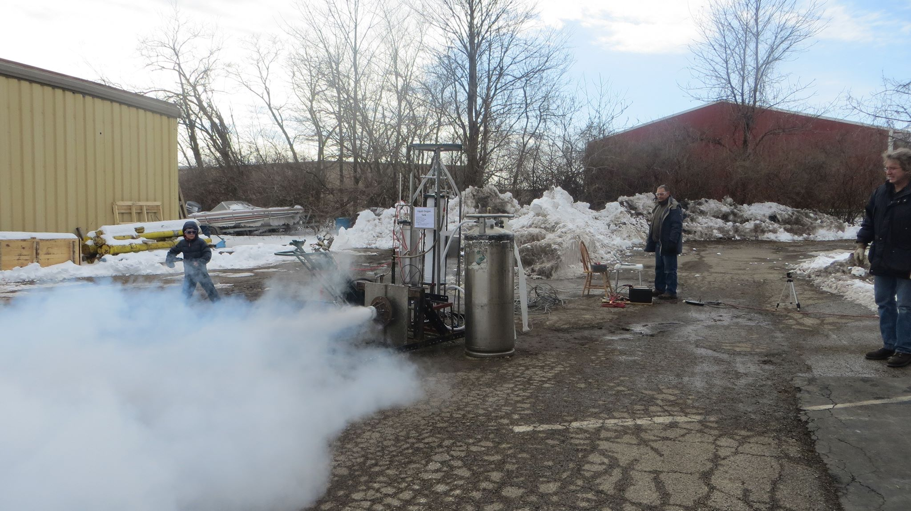

.. note::

    I don't mean programming isn't hard.  It is hard.  But...

    This is an experiment by the Midwest Propulsion Group,
    an organization in Dayton
    that takes model rocketry to the point where they're
    in danger of violating UN Security Council resolutions.

    But even though they're a very talented, dedicated, amazing group,
    they're not going into space.

    Without millions of dollars in funding, your rockets are not
    going to be space rockets.  Earth has no Beginners' Orbit.

----

More like gardening
-------------------

.. note::

    You can garden at any level.  You can raise one lousy basil plant
    on your windowsill, or you can grow and can a whole year's worth
    of vegetables and sell your surplus at the farmer's market, or
    anywhere in between.

----

Programming intros
------------------

- Math / abstract
- Websites
- Games
- Data

.. note::

    We have a huge wealth of introductory Python material:
    Classes, books, articles, blog posts...

    but the vast majority of it seems to be in these three
    categories, and I think we should add a fourth:
    data handling.

----

Projects
--------

.. note::

    What's within reach for a data amateur that's worth doing?

    Let's make this easier to think about with a very non-exhaustive list of
    possibilities to get your imaginations running ambitiously

----

`csv`

.. note::

    This should be one of the main teaching libraries.

    There are more specialized libraries for handling spreadsheets,
    but this is a minimal-mystery approach straight out of the
    Standard Library.

----

email

.. note::

    Most people feel overwhelmed by email.  It was the first form of
    information overload.

    The filters etc. provided by email providers are nowhere near as
    sophisticated and specific as the programs they could

    This is a huge source of personally relevant (maybe) data for most
    people.

----

social media
------------

twitter-scraper_ by Kenneth Reitz

.. _twitter-scraper: https://github.com/kennethreitz/twitter-scraper

.. note::

    Social media is probably the most commonly known source of data for
    companies to mine, which is all the more reason to help people
    work with their own social media data.

    Who is near my physically?  Who may be interested in an organization
    or an upcoming event I'm interested in?  Who's announced weekend plans?
    Who can I hitch a ride to PyOhio with?

    Are there hours of the day when I'm more likely to make misspellings
    or threaten foreign countries?

    It's such a familiar realm that it's easy to rouse people's curiosity
    about.

----

Webscraping

- requests_
- BeautifulSoup_
- requests-html_

.. _requests: https://github.com/requests/requests
.. _BeautifulSoup: https://www.crummy.com/software/BeautifulSoup/
.. _requests-html: https://github.com/kennethreitz/requests-html

.. note::

    Webscraping is getting data from websites that weren't
    designed to provide data to your programs, but only to
    be used by human eyeballs.  So it's a little tricky,
    but there are huge quantities of data locked up in it,
    and we have some good libraries to help us unlock it.

    These three in particular are pretty beginner-friendly

----

.. role:: strike
    :class: strike

:strike:`World Wide` Web

- Local directories
- Local event calendars
- Change detection

.. note::

    One of the nice things you can do with scraping is assemble
    and then republish locally relevant information.

    Is The World Wide part the worst thing about the Web?
    Global can crowd out local, or just suck your attention away
    from your own community.

    Local Resources, businesses, organizations, governmental bodies -
    they tend to publish independently on scattered, obscure websites.
    Many of them use a Facebook page as their only web presence, with
    important information buried deep in the feed.
    Can you unbury it?

    When there's a significant change on a Federal website, it often
    makes the news.  But do you know what's changing in your state,
    your county, your city?

    And speaking of information rescue...

----

PDFs

.. note::

    PDFs are visual presentations of data which should only be published
    alongside a useful form of that data.  Too many people don't understand
    that, and think that posting a PDF alone amounts to opening their data.
    That's like giving a zoo a pair of beanie babies for their endangered
    species breeding program.

    Extracting usable data from the PDF memory hole is a big challenge, so
    I hesitate to even suggest it for beginners, but they're inevitably
    going to encounter it a lot, so we need to give them someplace to start.
    If nothing else, they can help spread the word that this live-embalming
    of data has got to stop.

----

Self-generated data

- Files
- Photos

.. note::

    Most people with a personal computer have lost track of what is on it.
    They feel intimidated even by data of their own generation.  Code
    could help them organize and de-dupe.

----

- APIs

  - Governments
  - Social media
  - Vendors

.. note::

    What APIs are

    How to find them

    How to use them

    These are secrets we've been hoarding!

----

Open data hubs
--------------

- data.gov
- `Humanitarian Data Exchange`_
- `curated API lists`_
- `Open Data Census`_

.. _Open Data Census: http://us-cities.survey.okfn.org/
.. _Humanitarian Data Exchange: https://data.humdata.org/
.. _curated API lists: https://github.com/abhishekbanthia/Public-APIs
.. _Open Data Census: http://us-cities.survey.okfn.org/

  Beware firehose

.. note::

    There is an open data movement that urges institutions to
    publish data and curates a variety of directories to
    open data sources.

    Pick out something specific and guide them to it.

----

`Open Data Census`_
-------------------

.. _OpenData Census: http://us-cities.survey.okfn.org/

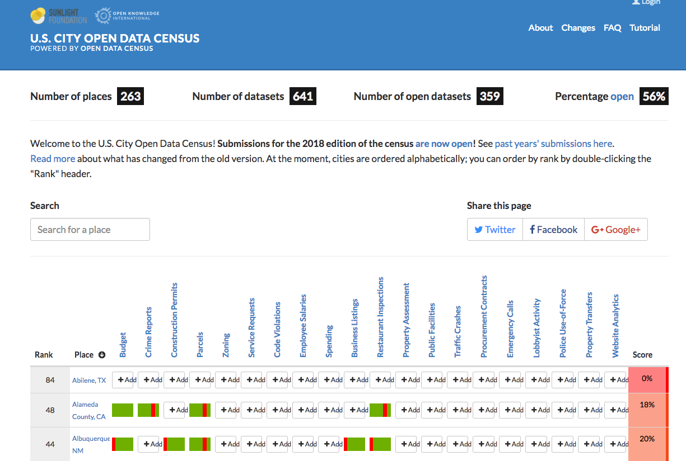

.. note::

    It improves data access locally, encourages your city
    to do more, and helps volunteers practice finding data

----

Presenting the info
-------------------

- Publishing: static site generation (Jekyll, Pelican, etc.)

- Visualizing: matplotlib, Bokeh, altair-viz...

- Mapping: Leaflet (Folium)

.. note::

    Minimalist presentations so you can get back to the data

    Full-fledged web development skills are optional here,
    unless that's the way they really want to go.

----

Re-presenting data
------------------

Dayton LotLinker_

.. _LotLinker: http://www.lotlinker.com/

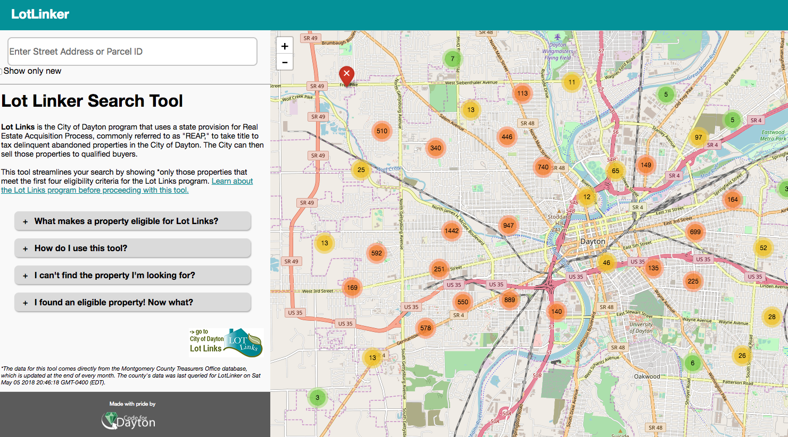

.. note::

    Dayton has abandoned, forfeited houses that you can buy from the city
    for about $2500, but the information about those houses was only available
    through a spreadsheet that was not a very good interface for finding places
    to consider.

    So Code for Dayton, our local Code for America brigade, processed that
    spreadsheet into a Leaflet map and published is as lotlinker.com.

    As you can see, we have room for all of you, so if you want to carpool to
    PyCon 2019 from your new house in Dayton, let me know.

----

`More ideas`_

.. _More ideas: http://opendatahandbook.org/value-stories/

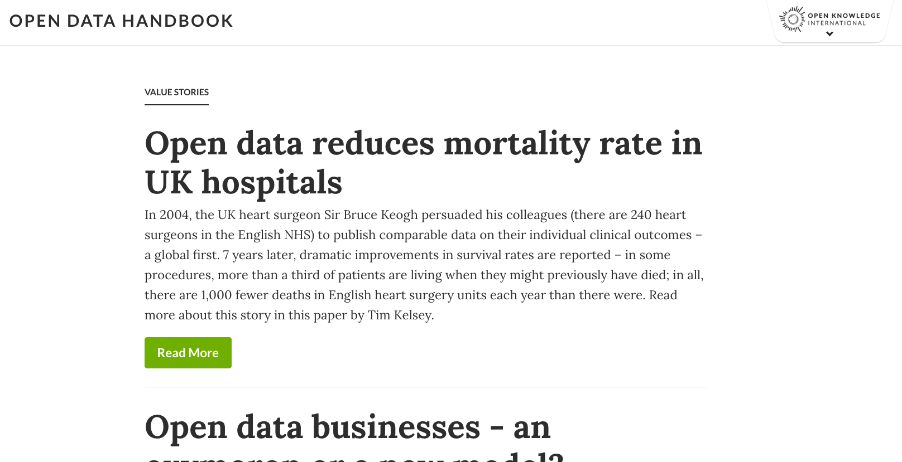

.. note::

    Open Knowledge International has a set of value stories
    that can jog your imagination.  Most of them are for large-
    scale data use, but they can still touch off related ideas
    in you - or, more importantly, in the people you're going
    to empower.

----

Code for America
----------------

Catherine Bracy - PyCon 2015 keynote

.. note::

----

Empower whom?

  - students (Jessica McKellar 2014 keynote)
  - journalists
  - small businesses
  - activists and organizers

.. note::

    I mean, aside from everyone, of course.

----

Local Governments

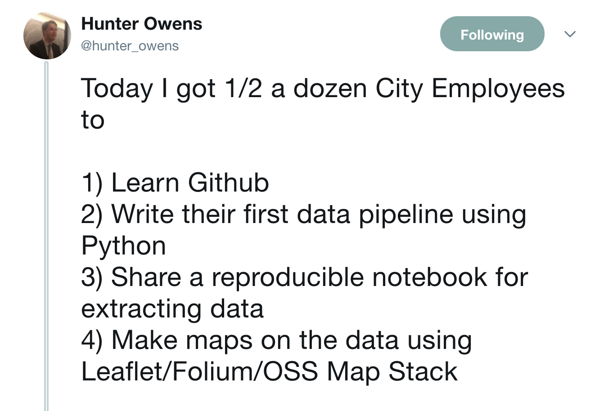

----

"How can I, a mere humble Pythonista with a bag full of PyCon swag,
help bring about this revolution?"

----

- Teach
- Write

  - blog
  - articles
  - books

    - Automate The Boring Stuff

.. note::

    Yes You Can!

    Small local publications, business publications...

    Automate the Boring Stuff by Al Sweigart

----

`Julia Evans`_
--------------

.. _Julia Evans: https://drawings.jvns.ca/

.. image:: img/pipes.svg
   :height: 600px

.. note::

    And while we're thinking about teaching and writing, I
    want to point you to Julia Evans' amazing Unix cartoons
    to urge you to expand your thinking about what teaching
    and writing can mean and what's actually useful and
    inviting to beginners.

----

`Data Carpentry`_
-----------------

.. _Data Carpentry: http://www.datacarpentry.org/

.. image:: img/DC_logo_vision.png

.. note::
    Data Carpentry is, in a sense, already on this problem,
    though they're aimed more at institutions full of people
    who are already convinced that they need to build their
    data skills.

    It's a great organization with a great curriculum, and a
    great program to train Data Carpentry instructors - worth
    checking out.

----

- Speak

  - not here

- Signal-boost

.. note::

    Do not underestimate how badly a variety of local groups want
    speakers!  Not necessarily Business groups, community groups,

    With most software problems, finding the right package to do it
    with is half the battle.  The other half is finding good tutorials
    or examples.  So, if you find them and help make them more
    prominent, you are a teacher.

----

Open that data
--------------

.. note::

    You are in a position to make the case

----

Make it easier

- Improve the API
- Wrap existing packages
- Connect existing code

.. note::

    Lots of software is structured with APIs that conform to the
    internal nature of the problem.  But an API can instead conform
    to the expectations of a person who doesn't yet understand the
    domain.

    Find or be a newbie, keep track of your guesses, and make the
    guesses right!

----

OKI's `data packages`_
----------------------

- OKI's `data packages`_

.. _data packages: https://frictionlessdata.io/data-packages/

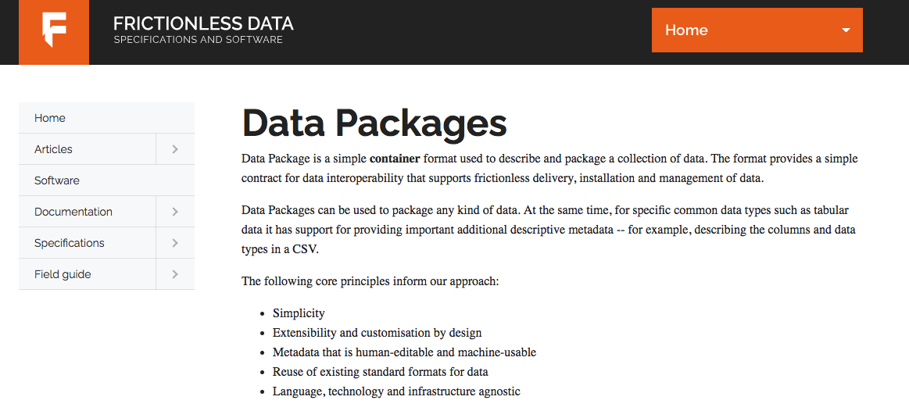

.. note::

    Data availability is not really boolean.  Lots of data is
    technically open or available, but actually difficult to
    find, download, and use.

    data-packages is a container format to wrap data and metadata
    together in a way that makes it easier to discover and lets
    people write tools to automate the process of getting it.

    So far, only a small fraction of data is published that way,
    and only a few people know how to use those tools, so this
    leads lots of signal-boosting!

----

Write the docs!
---------------

- Join projects
- File documentation PRs
- Create examples
- Answer questions

Ignorance is precious

.. note::

    ... which is, of course, the name of a conference

----

Honeywell 316 `Kitchen Minicomputer`_
-------------------------------------

.. _Kitchen Minicomputer: http://www.computerhistory.org/revolution/minicomputers/11/362

.. note::

    Neiman-Marcus catalog, 1969

    A gee-whiz technical solution that is completely wrong for the problem?

    To a certain degree, yes.  None of this absolves society or us personally
    from the non-technical aspects of saving the world.

    Still, we are nerds, glory be, and our nerdship is changing the
    world, so I think we're responsible to make sure at least some
    of those changes are positive.

----

Ambitions
---------

.. note::

    In between the immediate goals - creating a new website full
    of local data - and the final goal - a better world with an
    engaged public - what are the hoped-for connecting developments?

----

Civic engagement
----------------

- Sense of ownership
- Habits of participation

.. note::

    When you go to your city for data, that's engagement.

    When you nag them for data they haven't released yet, that's
    deeper engagement.

----

Data ethics
-----------

Diverse communities

.. note::

    Ethics in data science is a topic to itself, but the more
    people have experience even with small-scale data handling,
    the more people will understand its importance.

    Employees and informed outside feedback contributes to an
    institution's sense of data ethics, and broadening that
    base of feedback can produce a wider, truer sense of ethics.

----

Smarter data consumers
----------------------

.. note::

    People with a deeper awareness of how data is gathered
    and used.

----

Create open data demand
-----------------------

.. note::

    Knowing that data you've opened is being used is enormously
    motivating.  If you use data from an 18F-built API and we
    find out, it makes our day.

    As using data becomes the norm, it becomes less acceptable
    not to open up data.  Imagine a can of food with no ingredient
    label.  Even if that were legal - would you buy it?  Probably
    not, because ingredient labels have taught us to feel entitled
    to that data, whatever we do or don't do with it.

----

Strengthen local institutions
-----------------------------

.. note::

    Near-exclusive acccess to data-handling skill has been
    one advantage of big and global organizations over small
    and local ones.

    Not just businesses: can your community library, theater
    troupe, etc. compete for attention?

----

# TODO: close with heartwarming story

----

.. note::

    Josh Cory has been learning Python at the Dayton Dynamic
    Languages user group.  Kimber belongs to his friend Jeff.

----

Duck, turkey, pork, banana, peanut, fish, salmon, peas, oats, tomato and berries.

.. note::

   If you've seen dog food ingredient lists - they're long,
   fine-print monstrosities.  And there are dozens of dog
   food companies with multiple brands each.

----

.. code:: python

    ['duck', 'turkey', 'pork',
     'banana', 'peanut', 'fish',
     'salmon', 'peas', 'oats',
     'tomato', 'berries']

.. note::

    But as a data problem, this is not bad.

----

- Found API
- Downloaded dog food brand/flavors
- Extracted and normalized ingredient lists
- compared to `ALLERGIES`
- generated list of safe foods

----

.. note::

    Kimber is a good dog.

----

Questions?
----------

@catherinedevlin

catherine.devlin@gmail.com

github.com/catherinedevlin/talks

.. note::

    I'm consistently branded, easy to find,
    you know where I live, and I'm staying for
    sprints.

----

Pew Research results:

- http://www.pewresearch.org/fact-tank/2018/03/27/americans-complicated-feelings-about-social-media-in-an-era-of-privacy-concerns/

- http://www.pewinternet.org/2014/11/12/few-feel-that-the-government-or-advertisers-can-be-trusted/

Photos:

- “Sultan Mehmet III (reigned 1595-1603) Enthroned, Attended by Two Janissaries LACMA M.85.237.34” by Ashley Van Haeften is licensed under CC BY 2.0

- “Hospital food at the PA part one: &quot;Beef Burgundy&quot;” by David Jackmanson is licensed under CC BY 2.0

- Air Force IMSC http://www.afimsc.af.mil/News/Art/igphoto/2001839179/

- Mile Creek Farm https://milecreekfarm.com/photo-gallery/#jp-carousel-1733

- Midwest Propulsion Group
