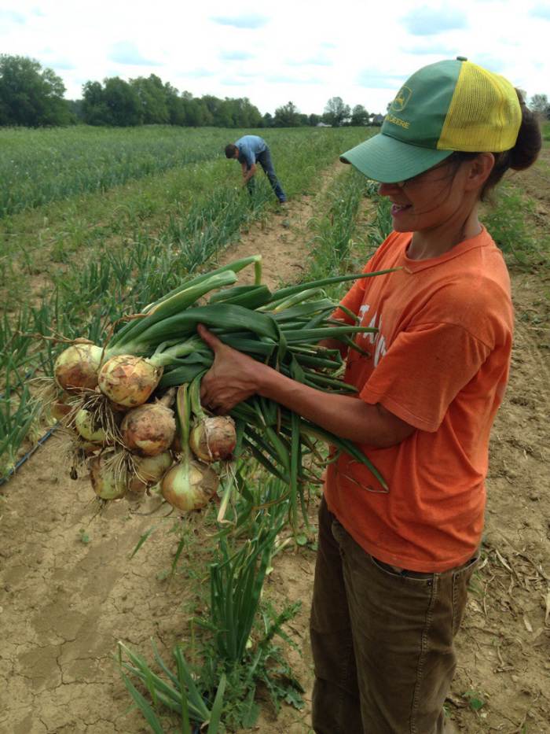
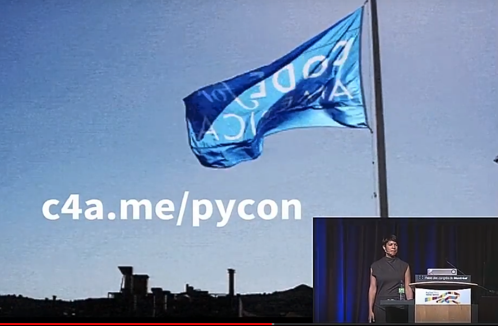

:css: css/smalldata.css
:data-transition-duration: 200

.. title:: small data

----

small data
----------

Catherine Devlin

PyCon 2018

----

WELCOME TO OHIO
===============

.. image:: img/ohio.svg
   :height: 600px

.. note::

    I love our flag.

----

PyOhio
------

.. image:: img/pyohio2018.jpg
   :height: 600px

.. note::

    Last weekend in July.

----

.. image:: img/dayton-to-cleveland.png

----

Data Is The New Oil
-------------------

.. image:: img/new_oil.png
   :height: 600px

----

- Fosters authoritarianism
- Degrades environment
- Trail of abandoned boomtowns

.. note::

    Commercial world is paying attention.

    We consider that a sign of importance.

----

Professionalization

Data Science

Technique, tools, standards...

(Salaries!)

----

Data janissaries?
-----------------

----

.. image:: img/hospital_food.jpg
   :height: 600px

.. note::

    If you're sick and a friend cooks you dinner, it's the
    sweetest thing in the world.

----

- Powerful
- Mysterious
- Out of your control

.. note::

    If we all believe that data is a new, controlling power in the world,
    and 90% of us believe that power is out of our control or even comprehension,
    that's a very alienating feeling.  That's a feeling that it's not your
    world anymore.

----

Pew Research:

    Americans’ lack of confidence in communications security is accompanied by low levels of trust in government and advertisers

    The backdrop for this lack of confidence in communications security is low levels of trust in key sectors that Americans associate with data collection and monitoring.

----

18F
---

.. image:: img/18f.svg
   :height: 300px

.. note::

    18F is a U. S. Federal agency that helps other Federal agencies build
    and buy software better, using the technology and the techniques
    that everybody in this room loves.

    In particular, it is chock-full of Python.

    You should consider doing a tour among the amazing Pythonistas
    of 18F.  It's been the best experience of my professional life.

----

Not 18F
-------

.. note::

    Not an 18F talk

    I am on vacation.

    If my supervisor calls, you haven't seen me.

----

USASpending.gov
---------------

.. image:: img/usaspending-frontend.png
   :height: 600px

----

USASpending.gov API
-------------------

.. image:: img/usaspending-api.png
   :height: 600px

----

"I bet they don't want to let that out!"

.. note::

    18F is an incredibly idealistic place, but being there has
    shown me how low expectations around the government has become.

    Which is sad, because it's our government!

----

Do not trust your government.

----

Manage your government.

.. note::

    We are your employees.

----

.. code:: python

    cynicism == (learned_helplessness
                 + resentment)

    empowerment == engagement

.. note::

    People think of cynicism as a defense against manipulation,
    but it's actually how we are manipulated - into inaction,
    into selfishness, into withdrawl.  Cynicism divides us and
    conquers us, which is why some groups deliberately foster it.

    Some people want that cynicism, disengagement, despair, passivity.

    https://arstechnica.com/tech-policy/2018/04/trump-praises-sinclair-for-spreading-fake-news-warning-on-tv-stations/

    0:50

----

Manage your society.

Data is a tool.

.. note::

    Being a participant in society, not a consumer

----

Chickens
--------

.. image:: img/chickens.jpg
   :height: 600px

.. note::

    This is where my eggs come from.

    Oddly enough, nowhere on earth have I faced as much peer
    pressure to keep my own chikens as at PyCon.

----

Mile Creek Farm CSA
-------------------

.. note::

    Most of our food supply is heavily commercialized, industrialized.

    There's a huge movement of small farmers, organic farmers,
    gardeners, farmers' markets, community-supported agriculture,
    all creating small-scale, local alternate channels to that
    mainstream food industry.

    The starry-eyed ones may imagine replacing the conventional
    food industry, but most believe than even a small-scale alternative
    can improve the world - engagement, familiarity, mindfulness.

    They are democratizing the food supply.

    They're not democratizing it completely.  Most people still don't
    garden.  Most food still comes through the industrial food pipeline.
    But every little bit of extra contact that people have with food
    production makes a difference.  2% is better than 1%.  5% is better
    than 2%.

----

Data Creek Farm
---------------

.. image:: img/datacreek3.jpg
   :height: 600px

.. note::

    So imagine rows of data sprouting in the sun behind
    ordinary people's homes.

    Imagine little community orchards bursting
    with fresh, ripe JSON.

    Imagine community data markets with baskets brimming over
    with organic, sustainably, humanely grown integers,
    strings, floats, and decimals.

    In other words, can we have a movement to democratize
    use of data that's like the movement to democratize
    the growth of food?

----

Why Python?
-----------

.. image:: img/jupyter.png
   :height: 300px

.. note::

    Many of us were drawn to Python specifically because it's
    so amateur-friendly.

    Many of the biggest tools in the professional data science
    community was made by physical scientists, not computer
    scientists.

    So, of all people, we in the Python world ought to be
    the ones to keep amateurs access to data.

----

Skills
------

- Gathering
- Processing
- Combining
- Transferring
- Visualizing

----

Not a teacher?
--------------

You are still an *empowerer*.

.. note::

    ... Bear with me, because you will gradually see why I think
    you have a big part in this whether you teach or not.

----

Programming: Not rocket science
-------------------------------

.. image:: img/rocketry2.jpg
   :height: 600px

.. note::

    I don't mean programming isn't hard.  It is hard.  But...

    This is an experiment by the Midwest Propulsion Group,
    an organization in Dayton
    that takes model rocketry to the point where they're
    in danger of violating UN Security Council resolutions.

    But even though they're a very talented, dedicated, amazing group,
    they're not going into space.  Earth has no beginners' level orbit.

    Without millions of dollars in spending, your rockets are not
    going to be space rockets.

----

More like cooking
-----------------

.. image:: img/cooking.jpg
   :height: 600px

----

Programming intros
------------------

- Math / abstract
- Websites
- Games

.. note::

    We have a huge wealth of introductory Python material:
    Classes, books, articles, blog posts...

    but the vast majority of it seems to be in these three
    categories, and I think we should add a fourth:
    data handling.

----

Projects
--------

.. note::

    What's within reach for a data amateur that's worth doing?

    Let's make this easier to think about with a very non-exhaustive list of
    possibilities to get your imaginations running ambitiously

----

`csv`

.. note::

    This should be one of the main teaching libraries.

    There are more specialized libraries for handling spreadsheets,
    but this is a minimal-mystery approach straight out of the
    Standard Library.

----

email

.. note::

    Most people feel overwhelmed by email.  It was the first form of
    information overload.

    This is a huge source of personally relevant (maybe) data for most
    people.

    The filters etc. provided by email providers are nowhere near as
    sophisticated and specific as the programs they could

----

social media
------------

twitter-scraper_ by Kenneth Reitz

.. _twitter-scraper: https://github.com/kennethreitz/twitter-scraper

.. note::

    Social media is an obvious target because so much
    work has been done by companies or third-parties or sleazy
    political organizations, but individuals
    haven't yet taken hold of their own social media destiny.

    Who is near my physically?  Who may be interested in an organization
    or an upcoming event I'm interested in?  Who's announced weekend plans?
    Who can I hitch a ride to PyOhio with?

    Are there hours of the day when I'm more likely to make misspellings
    or threaten foreign countries?

----

Webscraping

- requests_
- BeautifulSoup_
- requests-html_

.. _requests: https://github.com/requests/requests
.. _BeautifulSoup: https://www.crummy.com/software/BeautifulSoup/
.. _requests-html: https://github.com/kennethreitz/requests-html

----

.. role:: strike
    :class: strike

:strike:`World Wide` Web

- Local directories
- Local event calendars
- Change detection

.. note::

    One of the nice things you can do with scraping is assemble
    and then republish locally relevant information.

    Is The World Wide part the worst thing about the Web?
    Global can crowd out local, or just suck your attention away
    from your own community.

    Local Resources, businesses, organizations, governmental bodies -
    they tend to publish independently on scattered, obscure websites.
    Can you help them with that?

    Changes to Federal websites often make the news.  But do you know
    what your state government is up to?  Your county?  Your city?

    Also, many small businesses and institutions use Facebook as their
    *only* web presence, which can make their information hard to access.
    Can you rescue their semi-hidden information?

    And speaking of information rescue...

----

PDFs

.. note::

    PDFs are visual presentations of data which should only be published
    alongside a useful form of that data.  Too many people don't understand
    that, and think that posting a PDF alone amounts to opening their data.
    That's like giving a zoo a pair of beanie babies for their endangered
    species breeding program.

    Extracting usable data from the PDF memory hole is a big challenge, so
    I hesitate to even suggest it for beginners, but they're inevitably
    going to encounter it a lot, so we need to give them someplace to start.
    If nothing else, they can help spread the word that this live-embalming
    of data has got to stop.

----

Self-generated data

- Files
- Photos

.. note::

    Most people with a personal computer have lost track of what is on it.
    They feel intimidated even by data of their own generation.  Code
    could help them organize and de-dupe.

----

- APIs

  - Governments
  - Social media
  - Vendors

.. note::

    What APIs are
    How to find them
    How to use them

----

Open data hubs
--------------

- data.gov
- `Open Data Census`_
- `Humanitarian Data Exchange`_
- `curated API lists`_
- `Open Data Census`_

.. _Open Data Census: http://us-cities.survey.okfn.org/
.. _Humanitarian Data Exchange: https://data.humdata.org/
.. _curated API lists: https://github.com/abhishekbanthia/Public-APIs
.. _Open Data Census: http://us-cities.survey.okfn.org/

  Beware firehose

.. note::

    There is an open data movement that urges institutions to
    publish data and curates a variety of directories to
    open data sources.

    Pick out something specific and guide them to it.

----

`Open Data Census`_
-------------------

.. _OpenData Census: http://us-cities.survey.okfn.org/

.. note::

    It improves data access locally, encourages your city
    to do more, and helps volunteers practice finding data

----

Presenting the info

- Publishing: static site generation (Jekyll, Pelican, etc.)

- Visualizing: matplotlib, Bokeh, altair-viz...

.. note::

    Minimalist presentations so you can get back to the data

    Full-fledged web development skills are optional here,
    unless that's the way they really want to go.

----

`More ideas`_

.. _More ideas: http://opendatahandbook.org/value-stories/

.. note::

    Open Knowledge International has a set of value stories
    that can jog your imagination.  Most of them are for large-
    scale data use, but they can still touch off related ideas
    in you - or, more importantly, in the people you're going
    to empower.

----

Code for America
----------------

Catherine Bracy - PyCon 2015 keynote

----

Empower whom?

  - students (Jessica McKellar 2014 keynote)
  - journalists
  - small businesses
  - activists and organizers

.. note::

    I mean, aside from everyone, of course.

----

Local Governments

----

"How can I, a mere humble Pythonista with a bag full of PyCon swag,
help bring about this revolution?"

----

- Teach
- Write

  - books
  - articles
  - blog

.. note::

    Yes You Can!

    Small local publications, business publications...

----

`Julia Evans`_
--------------

.. _Julia Evans: https://drawings.jvns.ca/

.. image:: img/pipes.svg
   :height: 600px

.. note::

    And while we're thinking about teaching and writing, I
    want to point you to Julia Evans' amazing Unix cartoons
    to urge you to expand your thinking about what teaching
    and writing can mean and what's actually useful and
    inviting to beginners.

----

`Data Carpentry`_
-----------------

.. _Data Carpentry: http://www.datacarpentry.org/

.. image:: img/DC_logo_vision.png

.. note::
    Data Carpentry is, in a sense, already on this problem,
    though they're aimed more at institutions full of people
    who are already convinced that they need to build their
    data skills.

    It's a great organization with a great curriculum, and a
    great program to train Data Carpentry instructors - worth
    checking out.

----

- Speak
  - not here
- Signal-boost

.. note::

    Do not underestimate how badly a variety of local groups want
    speakers!  Not necessarily Business groups, community groups,

    With most software problems, finding the right package to do it
    with is half the battle.  The other half is finding good tutorials
    or examples.  So, if you find them and help make them more
    prominent, you are a teacher.

----

Open that data

.. note::

    You are in a position to make the case

----

Make it easier

- Improve the API
- Wrap existing packages
- Connect existing code

.. note::

    Lots of software is structured with APIs that conform to the
    internal nature of the problem.  But an API can instead conform
    to the expectations of a person who doesn't yet understand the
    domain.

    Find or be a newbie, keep track of your guesses, and make the
    guesses right!

----

Package your data

Repackage others' data

- OKI's `data packages`_

.. _data packages: https://frictionlessdata.io/data-packages/

.. note::

    Data availability is not really boolean.  Lots of data is
    technically open or available, but actually difficult to
    find, download, and use.

    data-packages is a container format to wrap data and metadata
    together in a way that makes it easier to discover and lets
    people write tools to automate the process of getting it.

    So far, only a small fraction of data is published that way,
    and only a few people know how to use those tools, so this
    leads lots of signal-boosting!

----

Write the docs!
---------------

- Join projects
- File documentation PRs
- Create examples

Ignorance is precious

.. note::

    ... which is, of course, the name of a conference

----

Ambitions

.. note::

    In between the immediate goals - creating a new website full
    of local data - and the final goal - a better world with an
    engaged public - what are the hoped-for connecting developments?

----

Honeywell 316 `Kitchen Minicomputer`_
-------------------------------------

.. _Kitchen Minicomputer: http://www.computerhistory.org/revolution/minicomputers/11/362

.. image:: img/kitchen_computer.png
   :height: 600px

.. note::

    Neiman-Marcus catalog, 1969

    A gee-whiz technical solution that is completely wrong for the problem?

    To a certain degree, yes.  None of this absolves society or us personally
    from the non-technical aspects of saving the world.

    Still, we are nerds, glory be, and our nerdship is changing the
    world, so I think we're responsible to make sure at least some
    of those changes are positive.

----

Civic engagement

- Sense of ownership
- Habits of participation

.. note::

    When you go to your city for data, that's engagement.

    When you nag them for data they haven't released yet, that's
    deeper engagement.

----

Data ethics

Diverse communities

.. note::

    Ethics in data science is a topic to itself, but the more
    people have experience even with small-scale data handling,
    the more people will understand its importance.

    Employees and informed outside feedback contributes to an
    institution's sense of data ethics, and broadening that
    base of feedback can produce a wider, truer sense of ethics.

----

Smarter data consumers

.. note::

    People with a deeper awareness of how data is gathered
    and used.

----

Create open data demand

.. image:: img/ingredients.jpg

.. note::

    Knowing that data you've opened is being used is enormously
    motivating.  If you use data from an 18F-built API and we
    find out, it makes our day.

    As using data becomes the norm, it becomes less acceptable
    not to open up data.  Imagine a can of food with no ingredient
    label.  Even if that were legal - would you buy it?  Probably
    not, because ingredient labels have taught us to feel entitled
    to that data, whatever we do or don't do with it.

----

Strengthen local institutions
-----------------------------

.. note::

    Near-exclusive acccess to data-handling skill has been
    one advantage of big and global organizations over small
    and local ones.

    Not just businesses: can your community library, theater
    troupe, etc. compete for attention?

----

# TODO: close with human interest story

----

.. image:: img/Kimber.jpg
   :height: 600px

.. note::

    Josh Cory has been learning Python at the Dayton Dynamic
    Languages user group.  Kimber belongs to his friend Jeff.

----

Duck, turkey, pork, banana, peanut, fish, salmon, peas, oats, tomato and berries.

.. note::

   If you've seen dog food ingredient lists - they're long,
   fine-print monstrosities.  And there are dozens of dog
   food companies with multiple brands each.

----

.. code:: python

    ['duck', 'turkey', 'pork',
     'banana', 'peanut', 'fish',
     'salmon', 'peas', 'oats',
     'tomato', 'berries']

.. note::

    But as a data problem, this is not bad.

----

- Found API
- Downloaded dog food brand/flavors
- Extracted and normalized ingredient lists
- compared to `ALLERGIES`
- generated list of safe foods

----

.. image:: img/Kimber.jpg
   :height: 600px

.. note::

    Kimber is a good dog.

----

Questions?

----

Pew Research results:

- http://www.pewresearch.org/fact-tank/2018/03/27/americans-complicated-feelings-about-social-media-in-an-era-of-privacy-concerns/

- http://www.pewinternet.org/2014/11/12/few-feel-that-the-government-or-advertisers-can-be-trusted/

Photos:

- “Sultan Mehmet III (reigned 1595-1603) Enthroned, Attended by Two Janissaries LACMA M.85.237.34” by Ashley Van Haeften is licensed under CC BY 2.0

- “Hospital food at the PA part one: &quot;Beef Burgundy&quot;” by David Jackmanson is licensed under CC BY 2.0

- Air Force IMSC http://www.afimsc.af.mil/News/Art/igphoto/2001839179/

- Mile Creek Farm https://milecreekfarm.com/photo-gallery/#jp-carousel-1733

- Midwest Propulsion Group
