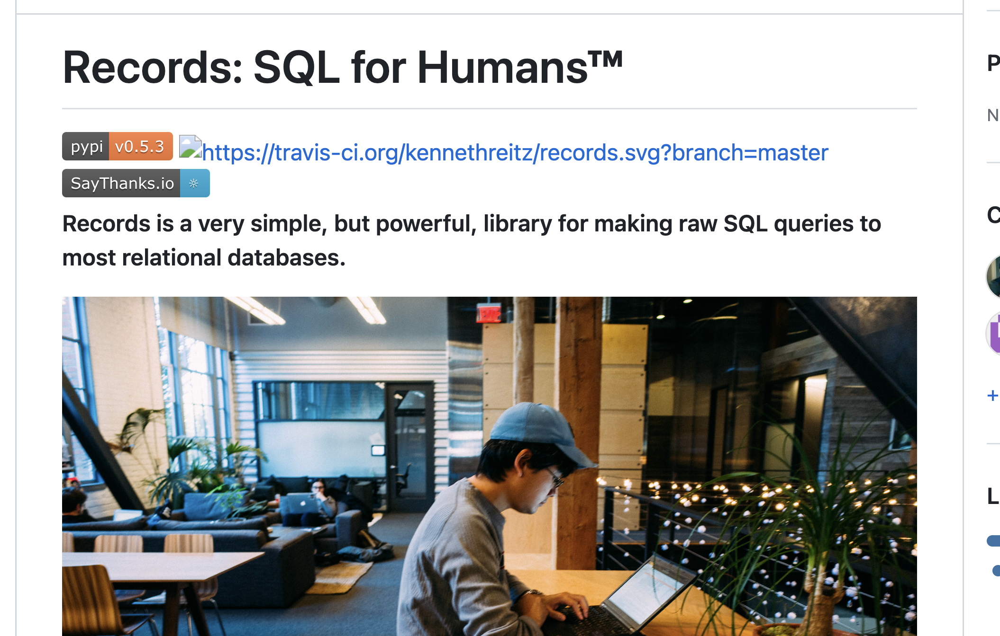
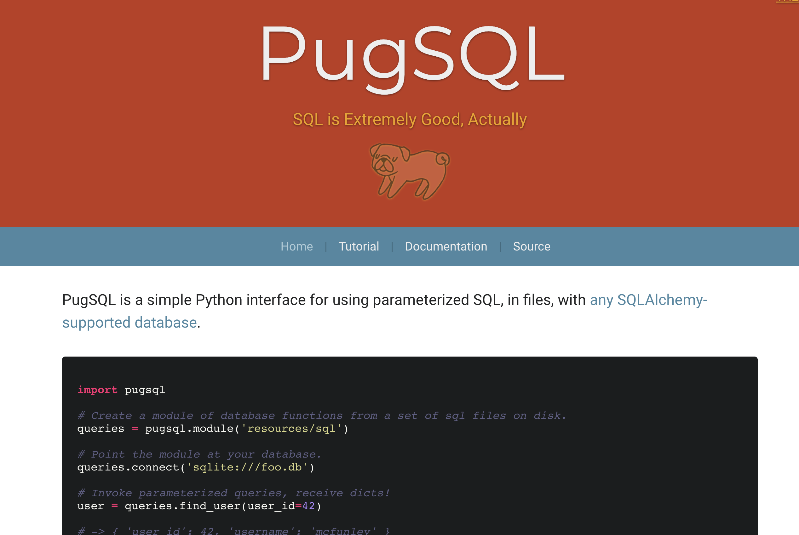
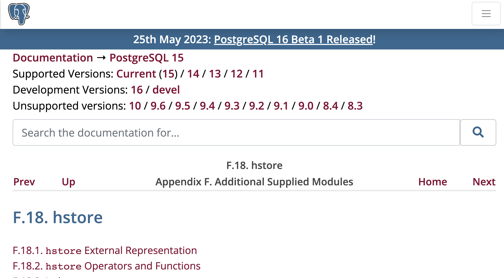
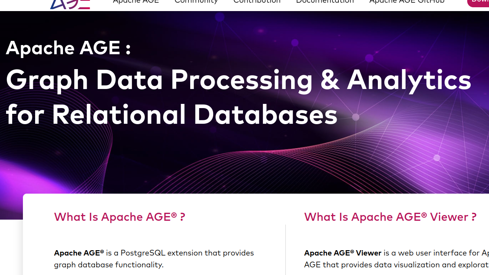
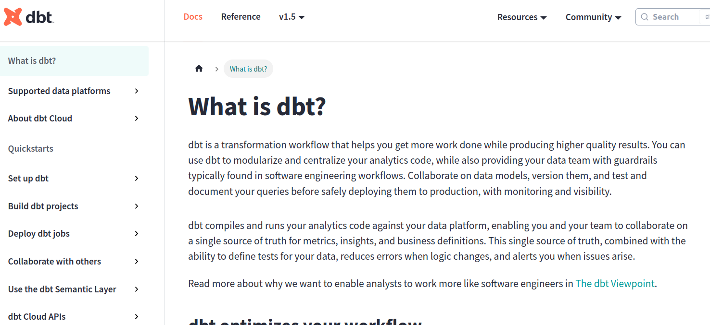
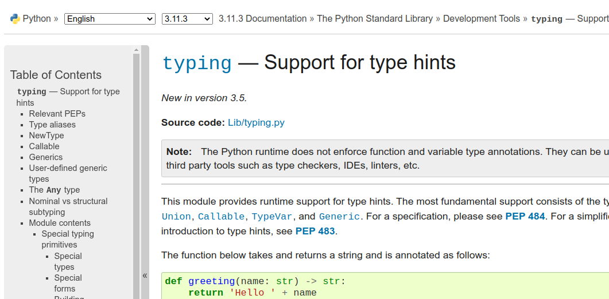
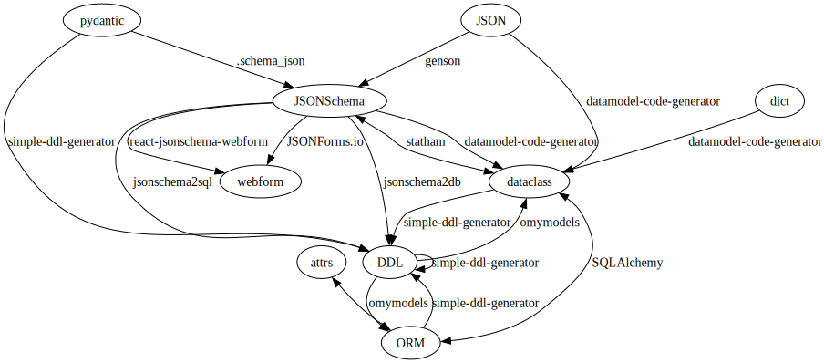
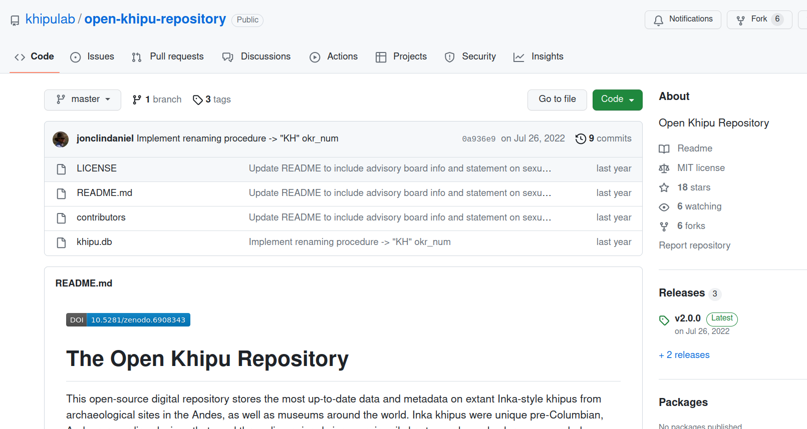

# Data: Clarity and Blur
Catherine Devlin
2023-06-09


https://github.com/catherinedevlin/talks/

<div class="notes">

Me disculpo porque solo sé un poco de español. Si desea hablar conmigo
en español, maravilloso. Por favor, hable muy despacio y utilice grandes
gestos.

</div>

------------------------------------------------------------------------

@catherinedevlin@tech.lgbt

Chelnik, the PostgreSQL elephant


<div class="notes">

No relation to Travis Oliphant

</div>

# [Quipu](https://essentials.neh.gov/projects/quipus-inca-language-knots)


<div class="notes">

Decimal system

</div>

## [Data comes first](https://www.bbc.com/news/business-39870485)


<div class="notes">

Writing down stories, laws, prose… optional

Recording data: mandatory

</div>

## [type: int](https://www.nature.com/articles/d41586-021-01429-6)


<div class="notes">

Or not so advanced

60,000 years ago, Neanderthal

</div>

## So where is it?


<div class="notes">

</div>

## Zen violation

> There should be one– and preferably only one –obvious way to do it.

<div class="notes">

There are lots of ways. And frankly none of them is obvious.

On-your-own learning

You may study, or stumble into, one technique

</div>

# Clarity and blur

Clarity: about categories

Blur: between categories

<div class="notes">

Clarity: what makes tecniques and approaches and technologies different

Blur: Boundaries

</div>

# Relationships

|                                     |                              |                           |
|-------------------------------------|------------------------------|---------------------------|
| nombre                              | diám_km                      | dia_d                     |
| Mercurio Venus Tierra Marte Júpiter | 4878 12100 12756 6794 142800 | 58.65 243.0 1.0 1.03 0.41 |

Data from [Royal Museums
Greenwich](https://www.rmg.co.uk/stories/topics/solar-system-data)

<div class="notes">

“Table” with “Rows”

“Relation” with “tuples”

Why?

</div>

## Not data

Venus

224.7 días

## Now it’s data

Venus **orbita alrededor del sol en** 224,7 días.

<div class="notes">

Meaning comes from relationship

</div>

## Table tells us the relationships

|                                     |                              |                           |
|-------------------------------------|------------------------------|---------------------------|
| nombre                              | diám_km                      | dia_d                     |
| Mercurio Venus Tierra Marte Júpiter | 4878 12100 12756 6794 142800 | 58.65 243.0 1.0 1.03 0.41 |

<div class="notes">

That’s what a table is *for* - it tells us how the elements of the data
relate

</div>

# Shapes of relationships

<div class="notes">

Is a rectangular table right?

No single answer

</div>

## Key:Value


<div class="notes">

Key: string, or at least hashable

Value: simple or complex

</div>

## Key-value access

``` python
import dbm
with dbm.open('período_sideral_d.dbm', 'c') as db:
    db['Marte'] = str(686.98)

with dbm.open('período_sideral_d.dbm') as db:
    print(db['Marte'])
```

    b'686.98'

<div class="notes">

Implementations fast and simple

Correspondence to dicts is great: “querying” is simply referring to a
key

Stores byte strings - you could use JSON to serialize complex data into
it, but you’d have to serialize and deserialize

</div>

## Shelve

``` python
import shelve
with shelve.open('planetas_shelf') as db:
    db['Marte'] = {'diám_km': 6794, 'año_d': 686.98}
    print(db['Marte']['diám_km'])
```

    6794

<div class="notes">

Shelve does that for you

Values store python objects, incl composites

Simplest document database -

“document”: case refers to the kind of structure that is represented

Still query by key

</div>

## Procedural “query”

[planetas.json](data/planetas.json)

``` python
with shelve.open('planetas.shelve.db') as db:
    for planeta, planeta_info in db.items():
        for luna in planeta_info['lunas']:
            if (luna['diám_km'] or 0) > 2000:
                print (planeta, luna['nombre'], luna['diám_km'])
```

    [('Saturno', 'Titán', 5150.0),
    ('Tierra', 'Luna', 3476.0),
    ('Júpiter', 'Io', 3652.0),
    ('Júpiter', 'Europa', 3138.0),
    ('Júpiter', 'Ganímedes', 5262.0),
    ('Júpiter', 'Calisto', 4800.0),
    ('Neptuno', 'Tritón', 3500.0)]

<div class="notes">

Pull everything into memory, apply Python

You don’t have to learn anything

bulky, slow

</div>

## Document query DSLs

MongoDB query-by-example

``` python
db.planetas.find({'diám_km': {'$gt': 10000},
                    'año_d': {'$lt': 500}}
```

Elastic query


## jq

``` python
jq.compile('.[] | {nombre: .nombre, mes: [.lunas[]?.rev_d]}'
        ).input(sistema_solar).all()
```

    [{'nombre': 'Mercurio', 'mes': []},
    {'nombre': 'Venus', 'mes': []},
    {'nombre': 'Tierra', 'mes': [27.322]},
    {'nombre': 'Marte', 'mes': [0.319, 1.262]},
    {'nombre': 'Júpiter',
    'mes': [0.295, 0.298, 0.498, 0.675, ...

<div class="notes">

Independent DSL for navigating structures

like a JSON file, or a document

Py libaries

</div>

## Rectangles

|                                     |                              |                           |
|-------------------------------------|------------------------------|---------------------------|
| nombre                              | diám_km                      | dia_d                     |
| Mercurio Venus Tierra Marte Júpiter | 4878 12100 12756 6794 142800 | 58.65 243.0 1.0 1.03 0.41 |

<div class="notes">

Intuitive and omnipresent.

Spreadsheets

Clipboard with a sign-up form

</div>

## Dataframes

``` python
import pandas as pd 
planetas = pd.read_csv('planetas.csv')
planetas.loc['Marte', 'año_d']
```

    686.98

``` python
planetas[planetas.año_d > 1000] \
    [['máx_ua', 'diám_km', 'año_d']]
```

|         | máx_ua | diám_km |   año_d |
|:--------|-------:|--------:|--------:|
| Júpiter |   5.45 |  142800 | 4331.86 |
| Saturno |  10.07 |  120000 | 10760.3 |
| Urano   |  20.09 |   52400 | 30684.7 |
| Neptuno |  30.32 |   48400 | 60189.5 |

Pandas, Polars, agate, Dask, Ray, Modin,
[more](https://github.com/jcmkk3/awesome-dataframes)

<div class="notes">

DataFrame object that supports LOTS of methods

Also repurposes square-bracket syntax for location and filtering

Familiar to Python folks

</div>

## Joins: why

|                       |               |                |
|-----------------------|---------------|----------------|
| nombre                | masa_t        | luna           |
| Mercurio Venus Tierra | 0.06 0.82 1.0 | None None Luna |

<div class="notes">

The problem with rectangular storage is that data often doesn’t really
fit that shape.

</div>

## uh-oh

|                             |                    |                       |                       |
|-----------------------------|--------------------|-----------------------|-----------------------|
| nombre                      | masa_t             | luna_1                | luna_2                |
| Mercurio Venus Tierra Marte | 0.06 0.82 1.0 0.11 | None None Luna Deimos | None None Luna Deimos |

## denormalized

|                                   |                         |                             |
|-----------------------------------|-------------------------|-----------------------------|
| nombre                            | masa_t                  | luna                        |
| Mercurio Venus Tierra Marte Marte | 0.06 0.82 1.0 0.11 0.11 | None None Luna Deimos Fobos |

<div class="notes">

Use repetition to cover over mismatch between rectangles and shape

Bulk Inconsistency danger

Is it so bad?

</div>

## Si, es tan mala

|                                                                                                                                                                   |                                                                                                                                         |                                                                                                                                               |
|-------------------------------------------------------------------------------------------------------------------------------------------------------------------|-----------------------------------------------------------------------------------------------------------------------------------------|-----------------------------------------------------------------------------------------------------------------------------------------------|
| nombre                                                                                                                                                            | masa_t                                                                                                                                  | luna                                                                                                                                          |
| Mercurio Venus Tierra Marte Marte Júpiter Júpiter Júpiter Júpiter Júpiter Júpiter Júpiter Júpiter Júpiter Júpiter Júpiter Júpiter Júpiter Júpiter Júpiter Júpiter | 0.06 0.82 1.0 0.11 0.11 317.89 317.89 317.89 317.89 317.89 317.89 317.89 317.89 317.89 317.89 317.89 317.89 317.89 317.89 317.89 317.89 | None None Luna Deimos Fobos Adrastea Amaltea Ananké Calisto Carmen Elara Europa Ganímedes Himalaya Io Leda Lisitia Metis Pasifae Sinope Thebe |

------------------------------------------------------------------------

## Normalize

|                             |                    |
|-----------------------------|--------------------|
| nombre                      | masa_t             |
| Mercurio Venus Tierra Marte | 0.06 0.82 1.0 0.11 |

|                   |                    |
|-------------------|--------------------|
| nombre            | planeta            |
| Luna Fobos Deimos | Tierra Marte Marte |

<div class="notes">

More elegant, but joining can be hard, too.

You’ve lost the business users.

</div>

## Joining DataFrames

``` python
lunas.join(planetas, 'planeta', lsuffix='_l', rsuffix='_p'
            )[['planeta', 'masas_t']]
```

|          | planeta | masas_t |
|:---------|:--------|--------:|
| Luna     | Tierra  |       1 |
| Fobos    | Marte   |    0.11 |
| Deimos   | Marte   |    0.11 |
| Metis    | Júpiter |  317.89 |
| Adrastea | Júpiter |  317.89 |
| Amaltea  | Júpiter |  317.89 |
| Thebe    | Júpiter |  317.89 |

<div class="notes">

We still have repetition… it’s just generated on-the-fly

</div>

## SQL

    SELECT p.nombre AS planeta,
        p.diám_km AS planeta_d_km,
        l.nombre AS luna,
        l.diámetro_media_km AS luna_d_km
    FROM   Planetas p
    JOIN   lunas l ON (l.planeta = p.nombre)
    WHERE  l.diámetro_media_km > 2000

|                                                        |                                                |                                               |                                                  |
|--------------------------------------------------------|------------------------------------------------|-----------------------------------------------|--------------------------------------------------|
| planeta                                                | planeta_d_km                                   | luna                                          | luna_d_km                                        |
| Tierra Júpiter Júpiter Júpiter Júpiter Saturno Neptuno | 12756 142800 142800 142800 142800 120000 48400 | Luna Io Europa Ganímedes Calisto Titán Tritón | 3476.0 3652.0 3138.0 5262.0 4800.0 5150.0 3500.0 |

<div class="notes">

SQL handles those joins mentioned before

</div>

## Documents too

``` python
planetas['Tierra']['atmosfero'] = [{'molecule': 'N2', 'mw_amu': 28}, 
                                   {'molecule': 'O2', 'mw_amu': 32}, 
                                   {'molecule': 'CO2', 'mw_amu': 44}]
planetas['Marte']['atmosfero'] = [ 
                                   {'molecule': 'CO2', 'mw_amu': 44}]
```

<div class="notes">

Freeform - represent arbitrary data shape

But tradeoff b/t repetition and joining remains

Not such consensus of how to express joins in a document structure

</div>

## Raw SQL from Python

- [DB-API2](https://cewing.github.io/training.codefellows/lectures/day21/intro_to_dbapi2.html)
- [Records](https://github.com/kennethreitz/records) by Kenneth Reitz



## ORMs

Object-Relational Mappers

<div class="notes">

Famous… often assumed

</div>

------------------------------------------------------------------------

    engine = sa.create_engine('sqlite:///planetas.db')
    with sa.orm.Session(engine) as session:
        stmt = sa.select(Planeta).where(Planeta.diám_km < 50000)
        for planeta in session.execute(stmt).scalars():
            for luna in planeta.lunas:
                print(f'{luna.nombre} orbita a {planeta.nombre} '
                    f'en posición {luna.pos}')

    Luna orbita a Tierra en posición I
    Fobos orbita a Marte en posición I
    Deimos orbita a Marte en posición II
    Náyade orbita a Neptuno en posición III
    Thalassa orbita a Neptuno en posición IV
    Despina orbita a Neptuno en posición V
    Galatea orbita a Neptuno en posición VI
    Larisa orbita a Neptuno en posición VII
    Proteo orbita a Neptuno en posición VIII
    Tritón orbita a Neptuno en posición I
    Nereida orbita a Neptuno en posición II
    Caronte orbita a Plutón en posición I

<div class="notes">

You can work with instances through an ORM pretty much like they were
any other Python objects. Instead of having to think about the joins
between related tables, you can navigate between related objects as
attributes of the instances.

</div>

## Boilerplate

``` python
class Base(DeclarativeBase):
    pass

class Planeta(Base):
    __tablename__ = "planetas"

    nombre: Mapped[str] = mapped_column(primary_key=True)
    mín_ua: Mapped[float] = mapped_column(Float)
    máx_ua: Mapped[Optional[float]] = mapped_column(Float, nullable=True)
    mín_ua: Mapped[Optional[float]] = mapped_column(Float, nullable=True)
    incl_orb_g: Mapped[Optional[float]] = mapped_column(Float, nullable=True)
    diám_km: Mapped[int] = mapped_column(Integer)
    obl: Mapped[float] = mapped_column(Float)
    masas_t: Mapped[float] = mapped_column(Float)
    incl_g: Mapped[int] = mapped_column(Integer)
    año_d: Mapped[Optional[float]] = mapped_column(Float, nullable=True)
    día_h: Mapped[float] = mapped_column(Float)
    
    lunas: Mapped[List["Luna"]] = relationship(
        back_populates="planeta"
    )

    def __str__(self):
        return self.nombre
        
class Luna(Base):
    __tablename__ = "lunas"

    nombre: Mapped[str] = mapped_column(primary_key=True)
    pos: Mapped[str] = mapped_column(String)
    rev_d: Mapped[float] = mapped_column(Float)
    diám_km: Mapped[Optional[float]] = mapped_column(Float, nullable=True)
    dist_km: Mapped[float] = mapped_column(Float)

    planeta_nombre: Mapped[str] = mapped_column(ForeignKey("planetas.nombre"))
    planeta: Mapped["Planeta"] = relationship(back_populates="lunas",)
```

<div class="notes">

Syntax varies from ORM to ORM

</div>

## Define tables once

- ORM first, then `Base.metadata.create_all(engine)`
- DDL first, then `metadata.reflect(bind=engine)`

<div class="notes">

If you are strategic, and if the ORM you choose supports it, you can
probably avoid defining the tables twice, once on the Python side and
once on the SQL side.

</div>

## More concise ORMs

[Hitchhiker’s Guide](https://docs.python-guide.org/scenarios/db/)

{fig-alt=“Hitchhikers’ Guide to Python
Databases page”)

## Query builders

``` python
import pypika as pk
planetas, lunas = pk.Tables('planetas', 'lunas')
q = (pk.Query 
    .select(lunas.star, planetas.diám_km)
    .from_(planetas) 
    .join(lunas) 
    .on(planetas.nombre == lunas.planeta_nombre)
    .where(planetas.diám_km < 60000)
    .where(lunas.diám_km > 100)
    )
print(q)
```

    SELECT "lunas".*,"planetas"."diám_km" 
    FROM "planetas" 
    JOIN "lunas" ON "planetas"."nombre"="lunas"."planeta_nombre" 
    WHERE "planetas"."diám_km"<60000 AND "lunas"."diám_km">100

<div class="notes">

At the border between writing raw SQL and an ORM, consider a query
builder.

SQL-based syntax (so, yes, another syntax to learn) - all the same
concepts and keywords

Why, though? Unless you just really hate SQL syntax?

</div>

## Composable

``` python
    q = (pk.Query 
        .from_(planetas) 
        .where(planetas.diám_km < 60000)     
        .join(lunas) 
        .on(planetas.nombre == lunas.planeta_nombre)
        .select(lunas.star, planetas.diám_km, )
        .where(lunas.diám_km > 100)
        )
    print(q)
```

    SELECT "lunas".*,"planetas"."diám_km" 
    FROM "planetas" JOIN "lunas" 
    ON "planetas"."nombre"="lunas"."planeta_nombre" 
    WHERE "planetas"."diám_km"<60000 
    AND "lunas"."diám_km">100

------------------------------------------------------------------------

## PugSQL



<div class="notes">

Another ORM option

Define queries with SQL, each in its own .sql file, inport, invoke
cleansly

</div>

## Graph

<div>

<div>


</div>

</div>

<div class="notes">

Like a document, this can easily represent an arbitrary structure

Actually stored as node -\> edge -\> node

</div>

------------------------------------------------------------------------

<div>

<div>


</div>

</div>

<div class="notes">

This looks out of hand, but you wouldn’t necessarily view the whole
graph at once. That’s what queries are for.

- Graph databases have query languages
- Often inspired by SQL
- Competing DSLs

</div>

# Breaking boundaries

- Data paradigm / shape
- Query
- Storage

<div class="notes">

Three separate decisions

“A SQL database”

</div>

------------------------------------------------------------------------



------------------------------------------------------------------------

## PostgreSQL JSON type

``` sql
CREATE TABLE planetas (
    nombre TEXT PRIMARY KEY, info JSON);

select nombre, 
        doc->'diám_km' AS diám_km, 
        doc->'año_d' AS año_d
from planetas_docs
where (doc->>'diám_km')::int > 20000;

CREATE INDEX ON planetas_docs(((doc->>'diám_km')::int));
```

<div class="notes">

Like a doc database, JSON not just string

drill in to select

index

</div>

## Cross-paradigm hosting

Database of one class acts as another

------------------------------------------------------------------------


<div class="notes">

Supports MongoDB, but uses PostgreSQL for its storage engine

I lied in my earlier slide showing MongoDB; I was actually showing
FerretDB.

</div>

------------------------------------------------------------------------



## Graphs without a graph database

[Using PostgreSQL as a graph
database](https://tech.ingrid.com/sql-as-graph-database/)

``` sql
WITH RECURSIVE traverse(node_id, entity_type, entity_id) AS (
    SELECT
    ...
)
SELECT
    traverse.entity_id as order_id
FROM traverse
...
```

<div class="notes">

RECURSIVE CTE: special sauce

PostgreSQL propaganda?

</div>

------------------------------------------------------------------------


<div class="notes">

Chelnik!

What did you do to our talk?

</div>

# SQLite


<div class="notes">

</div>

## Simplicity

|                | one machine | distributed   |
|----------------|-------------|---------------|
| in memory      | SQLite      | Apache Ignite |
| single file    | SQLite      | rqlite        |
| server-managed | PostgreSQL  | CockroachDB   |

- No server
- Python Standard Library support

<div class="notes">

beloved for quick projects, demos, single-user apps

serverless: file format + libraries to access

</div>

## [SQLite for Application Files](https://www.sqlite.org/appfileformat.html)


<div class="notes">

In fact, it’s so simple that you can use it when you weren’t even
thinking about using a database at all - you were just looking for a
data storage file format. Because it’s an efficient and versatile
format. There’s a good discussion of that in the SQLite docs.

</div>

## Simple != Weak

<div>

<div>


</div>

</div>

<div class="notes">

Python “scripting” language?

large amounts OK

lots of users / processes OK

Publish data, updated occasionally

lots of writers: not OK

</div>

## Baked data

Simon Willison: [The Baked Data architectural
pattern](https://simonwillison.net/2021/Jul/28/baked-data/)


<div class="notes">

Simon Willison wrote this great article on cheaply and easily hosting an
application if it relies on infrequently-updated data. Just put that
data in a single-file database like SQLite, and a cheap and basic real
or virtual server can handle the dynamic part.

</div>

## Datasette

[datasette data/planetas.sqlite](http://localhost:8001/)


<div class="notes">

Explore, visualize tool

Plugins for leaflet, dashboards,

Simple as SQLite itself

</div>

## Datasette-lite

[https://lite.datasette.io/?url=https://github.com
/catherinedevlin/talks/blob/master
/pycon_colombia_2023/data/planetas.sqlite](https://lite.datasette.io/?url=https://github.com/catherinedevlin/talks/blob/master/pycon_colombia_2023/data/planetas.sqlite)

<div class="notes">

blurring boundaries: PyIodide

Simon Willison did this with Datasette!

Why would I put this long ugly URL on my slide?

Only code!

I have never been this lazy in my life, and I love it!

</div>

## Cross-paradigm SQLite

- [SQLite as a document
  database](https://dgl.cx/2020/06/sqlite-json-support)
- [simple-graph](https://github.com/dpapathanasiou/simple-graph)
- [FTS5](https://www.sqlite.org/fts5.html): full-text for search

## Data Federation

Stop thinking about where data is hosted

<div class="notes">

Open your eyes now, chelnik

Blur boundaries:

Leave data in place… query it anyway

</div>

## PostgreSQL Foreign Data Wrappers


[source: CrunchyData
blog](https://www.crunchydata.com/blog/easy-mongo-from-your-postgres)

<div class="notes">

At that point, you can run queries against your foreign tables and
pretty much forget that they are foreign tables!

</div>

## Cloud storage / big data


<div class="notes">

Often, gangs of bullies accost innocent programmers and tell them that
they have to use a big data file format like Parquet.

</div>

## [Many many wrappers…](https://wiki.postgresql.org/wiki/Foreign_data_wrappers)

<div class="notes">

Ease, quality, documentation

performance, read-only

</div>

## SQL (itself) gets everywhere

<div class="notes">

Does not respect boundaries

</div>

## SQL to Pandas

``` python
qry = """SELECT p.nombre, p.diám_km, 
        l.nombre AS luna,
        l.diám_km AS luna_diám_km
FROM   planetas p 
JOIN   lunas l ON (l.planeta_nombre = p.nombre)"""
df = pd.read_sql(qry, 'sqlite:///planetas.db')
...
df.write_sql("new_tbl", connection)
```

## [JupySQL](https://jupysql.ploomber.io/en/latest/quick-start.html)


<div class="notes">

I love JupySQL because it’s the second time somebody picked up one of my
personal projects and made it into something far better than I could.

</div>

## JupySQL to Pandas

    %%sql result << 
    SELECT p.nombre, p.diám_km, 
            l.nombre AS luna,
            l.diám_km AS luna_diám_km
    FROM   planetas p 
    JOIN   lunas l ON (l.planeta_nombre = p.nombre)

    result.DataFrame()

## SQL for Big Data

- File formats like Parquet, Avro, ORC
- Engines for access: Apache Spark, Presto, DuckDB, Apache Drill…

<div class="notes">

“Big Data” and “NoSQL” are often used as near-synonyms, yet most of the
“Big Data” query engines support SQL. They may also support a variety of
APIs for Python-style access, but of course, those APIs are different
for each one.

</div>

## dbt: SQL for ETL



<div class="notes">

Data transformation

Very old-fashioned SQL

-ize words: Organize, parallelize, visualize

Clean and manageable

</div>

## Family members

SQLite -\> rqlite, DuckDB

PostgreSQL -\> CockroachDB, Crunchy, Yugabyte, Supabase…

<div class="notes">

Plus the proprietary hosted variants.

Leveraging personal & community experience

</div>

# Order vs. Freedom

------------------------------------------------------------------------


<div class="notes">

Generally, in these rectangle-based formats, it’s very clear which
fields are and are not present.

</div>

------------------------------------------------------------------------

``` sql
ALTER TABLE planetas 
ADD COLUMN (anillos BOOL 
                    NOT NULL 
                    DEFAULT FALSE);
```

<div class="notes">

In fact, you may need to run code to add a field that wasn’t previously
present.

</div>

------------------------------------------------------------------------

``` python
planetas['Saturno']['anillos'] = True
```

<div class="notes">

Whereas, in documents or graphs, by default you can just toss in
whatever values and relationships you wish.

This can be very freeing and fun.

</div>

------------------------------------------------------------------------

``` python
planetas['Saturno']['anillos'] = True
planetas['Júpiter']['anillos'] = True
planetas['Tierra'] ['anllos'] = False
```

<div class="notes">

Mistakes

Not self-documented - your eyes or other tools

</div>

## [JSON Schema](https://json-schema.org/)

``` json
{
"$schema": "https://json-schema.org/draft/2020-12/schema",
"$id": "https://example.com/product.schema.json",
"title": "Product",
"description": "A product from Acme's catalog",
"type": "object",
"properties": {
    "productId": {
    "description": "The unique identifier for a product",
    "type": "integer"
    }
},
"required": [ "productId" ]
}
```

<div class="notes">

Validate like Pydantic

</div>

------------------------------------------------------------------------



<div class="notes">

Does this tradeoff remind you of anything?

</div>

## Dataclasses / attrs

``` python
from dataclasses import dataclass 

@dataclass 
class Planeta:

    nombre: str 
    diám_km: int
    año_d: float

Planeta(nombre='Júpiter', diám_km=142800, año_d=4331.865)
```

<div class="notes">

Lukasz: defined organization enables technologies

Defined schema enables documentation tools, editors

</div>

------------------------------------------------------------------------

``` python
@dataclass 
class Planeta_Dataclass:
    nombre: str 
    diám_km: int
    año_d: float

class Planeta_Model(Base):
    __tablename__ = "planetas"

    nombre: Mapped[str] = mapped_column(primary_key=True)
    diám_km: Mapped[int] = mapped_column(Integer)
    año_d: Mapped[Optional[float]] = mapped_column(Float, nullable=True)
```

<div class="notes">

So close together! Do we really need to define them separately!

</div>

## SQLAlchemy 2.0 - dataclass

and (attrs, Pydantic)

``` python
from sqlalchemy.orm import MappedAsDataclass

class Planeta(MappedAsDataclass, Base):
    __tablename__ = "planetas"

    nombre: Mapped[str] = mapped_column(primary_key=True)
    diám_km: Mapped[int] = mapped_column(Integer)
    año_d: Mapped[Optional[float]] = mapped_column(Float, nullable=True)
    ...
```

<div class="notes">

Latest SQLAlchemy release blurs that boundary with a mixin

Also integrations with attrs and Pydantic

</div>

## Laziness

<div class="notes">

Not talking about data loading. I mean that I am lazy. I love that
mixin.

</div>

## Fake testing data

From Pydantic / dataclasses:
[Polyfactory](https://polyfactory.litestar.dev/)

From JSON Schema: [jsf](https://github.com/ghandic/jsf)

<div class="notes">

Love

</div>

## datamodel-codegen

``` bash
datamodel-codegen --input planetas.csv --input-file-type csv --output-model-type dataclasses.dataclass
```

    # generated by datamodel-codegen:
    #   filename:  planetas.csv
    #   timestamp: 2023-06-05T01:41:29+00:00

    from __future__ import annotations

    from dataclasses import dataclass

    @dataclass
    class Model:
        nombre: str
        mín_ua: str
        máx_ua: str
        incl_orb_g: str
        diám_km: str
        obl: str
        masas_t: str
        incl_g: str
        año_d: str
        día_h: str

<div class="notes">

Hand me my dataclass

Automated converters! Search for them!

</div>

## Automated converters



<div class="notes">

Partial map - my own research

glue together into pandat?

</div>

# Clarity please

## Units: put them in field names!


[Pint](https://pint.readthedocs.io/en/stable/)

<div class="notes">

Suffixes in field names

</div>

## SQL comments

    COMMENT ON COLUMN planetas.día_h IS 'período de rotación, en horas'


# Quipu


<div class="notes">

Can interpret numbers

Cannot interpret anchor knots colors - metadata

Alien invasion - protect and preserve

</div>

# Open Khipu



<div class="notes">

But let’s end on a happy note! There’s a large open-data database of
data meticulously describing thousands of quipu that have survived.

</div>

## Datasette-Lite for quipu

<https://lite.datasette.io/?url=https://github.com/khipulab/open-khipu-repository/blob/master/khipu.db>

<div class="notes">

And, because it’s a SQLite database posted to the web, you guessed it,
we can use Datasette-Lite to browse it, right where it is, writing no
code.

Published in SQLite, browsable with datasette

Modern data technology - to ancient one

Maybe even help researchers restore lost metadata

</div>
